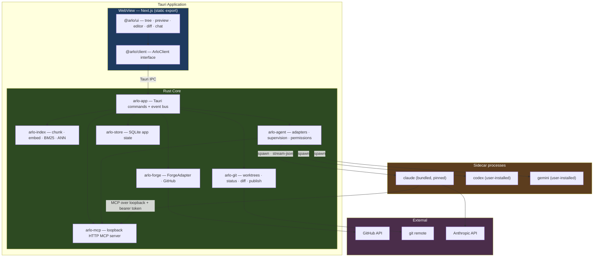
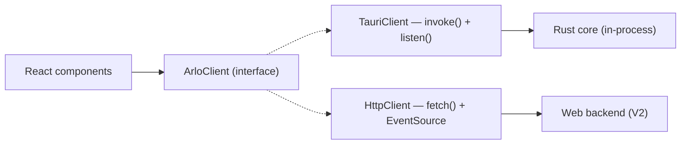
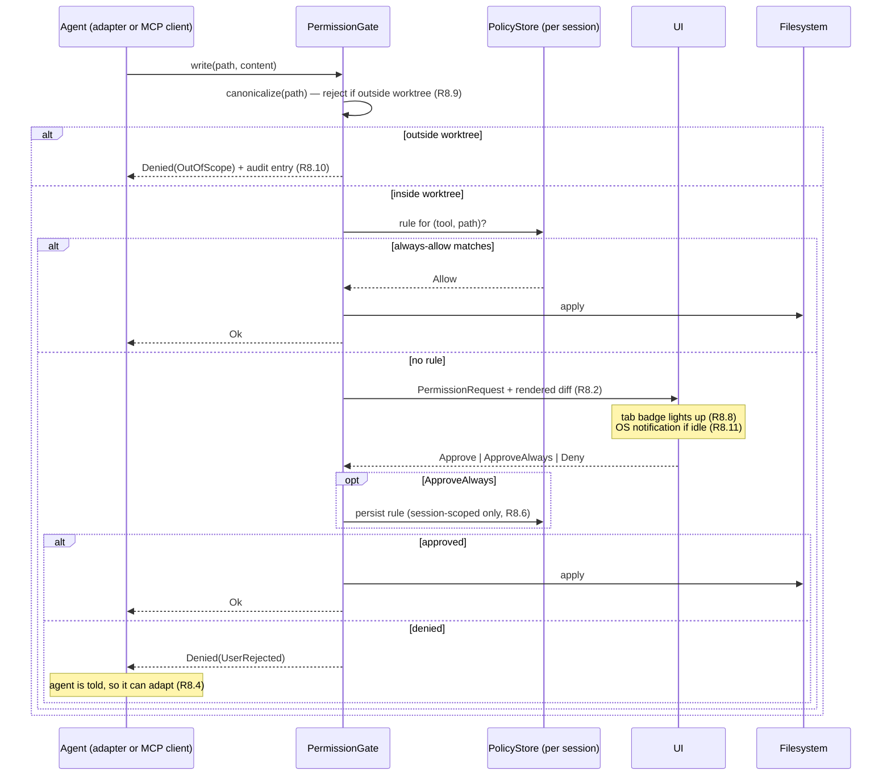
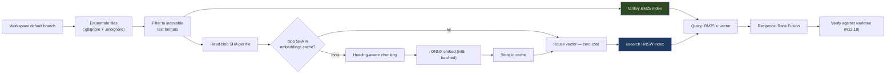
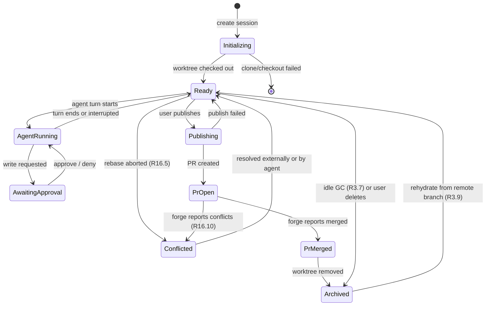
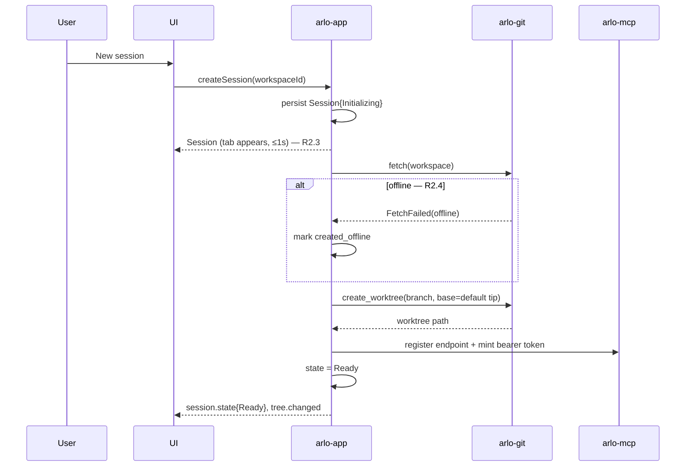
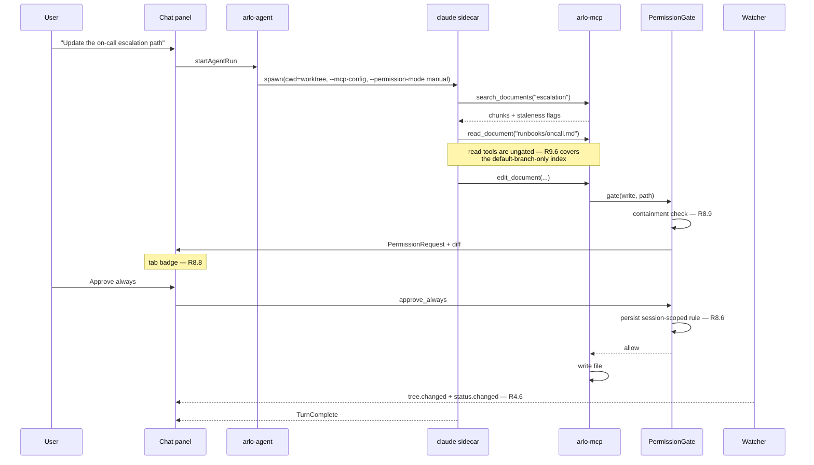
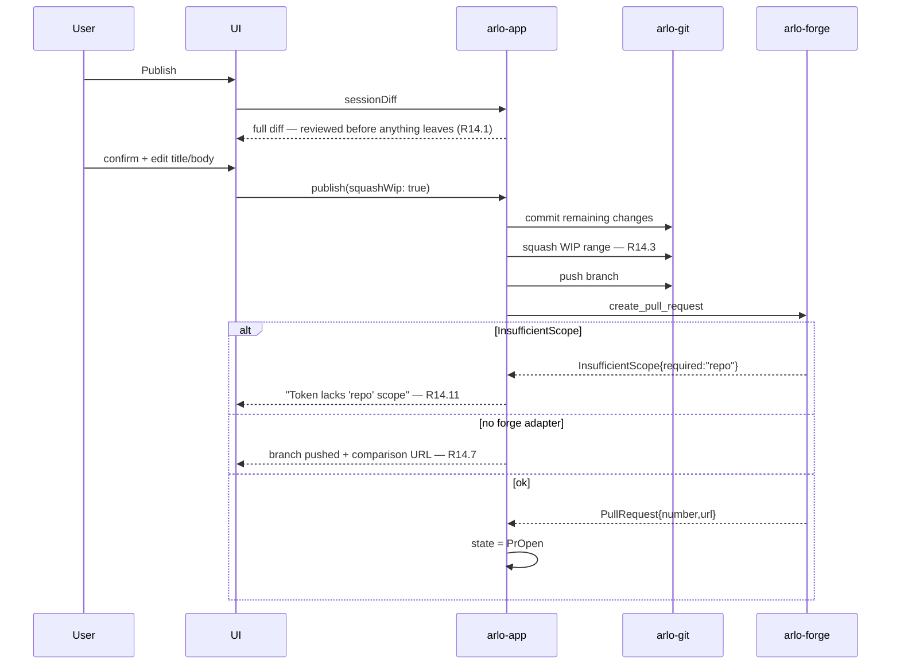
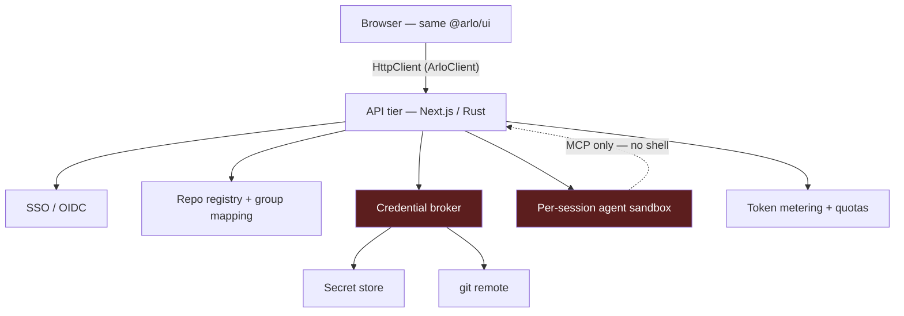

# Design Document — arlo-opendoc

## Overview

arlo-opendoc is a Tauri desktop application whose entire architecture derives from one
equation:

> **session = git worktree = branch = pull request**

Every design choice below follows from taking that seriously. Because a session is a real git
worktree, isolation is provided by git rather than by application logic. Because uncommitted
changes are the review surface, the file tree and diff view are not decorations — they are the
safety mechanism that makes autonomous agent editing acceptable. Because publishing means
opening a pull request, arlo never needs its own review, approval, or permission model for
*content*; it inherits the one the team already has.

### Design principles

1. **Git is the source of truth.** arlo holds no authoritative state that git could hold.
   Every session is reconstructible from `remote branch + worktree checkout`. If arlo's
   database is deleted, no user content is lost.
2. **The blast radius of an agent is one worktree.** Not the repository, not `main`, not the
   user's home directory. This is enforced at the path level in the Rust core, not by asking
   the agent nicely.
3. **One agent runtime.** The "native agent" is the `claude` adapter. There is no second
   implementation of the agent loop, permission gate, or tool surface.
4. **Documents are untrusted input.** Repository content is data an agent reads, never
   instructions arlo obeys. The permission gate is what contains this.
5. **Degrade honestly.** When a capability is missing — no forge, no agent credential, an
   adapter that cannot intercept permissions — the UI says so plainly rather than pretending.
6. **Transport-agnostic UI from day one.** Every frontend data access goes through one
   client interface. Desktop binds it to Tauri IPC; the V2 web tier binds it to HTTP. No
   component knows which.

### Key decisions and rationale

| Decision | Choice | Rationale | Rejected |
| --- | --- | --- | --- |
| Isolation unit | git worktree per session | Real isolation for free; branch and PR fall out naturally | Single mutable checkout; in-memory overlay FS |
| Agent runtime | `claude` CLI as sidecar, stream-json protocol | Agent SDK is TS/Python; Tauri has no Node runtime. The CLI adapter is needed anyway — reusing it removes an entire subsystem | Bundling Node + TS SDK; hand-rolled Rust agent loop |
| Git operations | `git` binary for mutations, `gix` for reads | The binary gets SSH agent, credential helpers, `worktree`, and `rebase` correct for free; a library re-implements all of it badly | libgit2 for everything |
| Index scope | Default branch only | Sessions change 1–10 files; indexing each worktree is wasteful. Agents read those files directly | Per-session full index; base + overlay index |
| Retrieval | BM25 ⊕ vector, fused by RRF | Pure vector fails on identifiers and error codes — the most common KB queries | Vector-only; keyword-only |
| Embeddings | Local int8 ONNX, multilingual | Corpus never leaves the machine; this is the primary enterprise argument | Hosted embedding API |
| Editor | CodeMirror 6, source only | WYSIWYG re-serialization turns a typo fix into a 200-line diff, destroying PR review | Tiptap/ProseMirror WYSIWYG |
| Conflicts | Rebase when clean, delegate when not | A 3-way merge UI is weeks of work for a rare path with good external tools | In-app merge editor |
| MCP scoping | Endpoint per session | The URL *is* the worktree — the scoping bug becomes unrepresentable | Global server with a session parameter |

---

## Architecture

### Process topology



### Transport-agnostic client seam

The single most important structural constraint. Every frontend data access flows through
`ArloClient`. Desktop implements it over Tauri IPC; V2 web implements it over HTTP + SSE.
No React component imports `@tauri-apps/api` directly.



### On-disk layout

```
${APP_DATA}/arlo/
  arlo.db                          # SQLite: workspaces, sessions, chat, permissions, audit
  embeddings.cache                 # blob-SHA → vector, content-addressed, shared by all workspaces
  models/
    multilingual-e5-small-int8.onnx
    tokenizer.json
  workspaces/{workspace_id}/
    repo/                          # the primary clone (default branch checked out)
    worktrees/{session_id}/        # one git worktree per session
    index/
      bm25/                        # tantivy index over the default branch
      vectors.usearch              # on-disk HNSW
      meta.json                    # provider · model · dim · indexed_commit
  logs/arlo.log                    # structured, credential- and content-redacted
```

**Recovery property:** everything under `workspaces/` is reconstructible. `repo/` re-clones,
`worktrees/` re-checkout from remote branches, `index/` rebuilds, `embeddings.cache` refills.
Only `arlo.db` holds non-reconstructible data (chat history, session names), and that is the
one thing to back up.

---

## Components and Interfaces

### `arlo-git` — repository operations

**The central implementation decision: hybrid git access.**

Mutating operations shell out to the `git` binary. Read operations use `gix` (gitoxide)
in-process.

*Why.* `git worktree add`, `git rebase`, `git fetch`, and `git push` need SSH agent
integration, `~/.ssh/config` parsing, `includeIf` conditional config, and platform credential
helpers (Keychain, Windows Credential Manager). libgit2 supports these partially and
inconsistently; gitoxide's mutation surface is still maturing. The `git` binary is on every
developer machine, is the definition of correct, and satisfies R1.4 and R1.5 for free. Read
operations — status, diff, tree listing, blob hashing — are hot paths called on every
filesystem event, so those run in-process where a subprocess round-trip would be visible.

```rust
pub trait GitOps: Send + Sync {
    // Worktree lifecycle
    async fn create_worktree(&self, ws: &WorkspaceId, branch: &str, base: &Oid)
        -> Result<PathBuf, GitError>;
    async fn remove_worktree(&self, path: &Path, force: bool) -> Result<(), GitError>;
    async fn rehydrate_worktree(&self, ws: &WorkspaceId, branch: &str)
        -> Result<PathBuf, GitError>;

    // Reads (gix, in-process, hot path)
    fn status(&self, worktree: &Path) -> Result<Vec<ChangedFile>, GitError>;
    fn diff_file(&self, worktree: &Path, path: &Path, base: &Oid)
        -> Result<FileDiff, GitError>;
    fn diff_session(&self, worktree: &Path, base: &Oid) -> Result<SessionDiff, GitError>;
    fn list_tree(&self, worktree: &Path, subpath: Option<&Path>)
        -> Result<Vec<TreeEntry>, GitError>;
    fn blob_sha(&self, path: &Path) -> Result<Oid, GitError>;
    fn commits_behind(&self, worktree: &Path, upstream: &str) -> Result<usize, GitError>;

    // Mutations (git binary)
    async fn fetch(&self, ws: &WorkspaceId) -> Result<FetchOutcome, GitError>;
    async fn commit(&self, worktree: &Path, msg: &str, author: Option<&Identity>)
        -> Result<Oid, GitError>;
    async fn push(&self, worktree: &Path, branch: &str, force: bool) -> Result<(), GitError>;
    async fn rebase_onto(&self, worktree: &Path, upstream: &str)
        -> Result<RebaseOutcome, GitError>;
    async fn revert_paths(&self, worktree: &Path, paths: &[PathBuf]) -> Result<(), GitError>;
    async fn squash_range(&self, worktree: &Path, from: &Oid, msg: &str)
        -> Result<Oid, GitError>;
}

pub enum RebaseOutcome {
    /// Applied cleanly. `undo_to` is the pre-rebase tip (R16.9).
    Clean { new_tip: Oid, undo_to: Oid, commits_applied: usize },
    /// Aborted and restored to the exact pre-rebase state (R16.5).
    ConflictedAndRestored { conflicting_paths: Vec<PathBuf> },
}
```

**Rebase safety protocol (R16.5, R16.9).** Never leave the user in a conflicted rebase:

1. Record `undo_to = current tip`, write it to `arlo.db`.
2. `git rebase <upstream>`.
3. On non-zero exit: `git rebase --abort`, verify tip equals `undo_to`, return
   `ConflictedAndRestored`.
4. If `--abort` itself fails: `git reset --hard <undo_to>` and log a critical event.

### `arlo-agent` — adapters, supervision, permissions

```rust
#[derive(Clone, Copy, Debug)]
pub struct AdapterCapabilities {
    /// Emits parseable structured events (not just terminal text).
    pub structured_events: bool,
    /// Tool calls can be intercepted and gated by arlo (R10.6).
    pub permission_interception: bool,
    /// A prior conversation can be resumed.
    pub resume: bool,
    /// The MCP server can be injected via configuration.
    pub mcp_injection: bool,
    /// Cancellation without killing the process.
    pub graceful_cancel: bool,
}

#[async_trait]
pub trait AgentAdapter: Send + Sync {
    fn id(&self) -> &'static str;
    fn capabilities(&self) -> AdapterCapabilities;

    /// Locate the binary and read its version. `None` = not installed (R10.8).
    async fn detect(&self) -> Option<DetectedBinary>;
    /// Version this adapter was verified against, for the mismatch warning (R10.9).
    fn verified_version(&self) -> &'static str;

    async fn launch(&self, spec: LaunchSpec) -> Result<AgentHandle, AgentError>;
}

pub struct LaunchSpec {
    pub cwd: PathBuf,               // ALWAYS the session worktree (R10.4)
    pub mcp_endpoint: McpEndpoint,  // session URL + bearer token (R10.5)
    pub prompt: String,
    pub resume_token: Option<String>,
    pub permission_mode: PermissionMode,
}

/// Normalized event stream. Every adapter maps its native output onto this.
pub enum AgentEvent {
    TextDelta(String),
    ThinkingDelta(String),
    ToolRequested { id: ToolCallId, name: String, input: serde_json::Value },
    ToolResult { id: ToolCallId, ok: bool, summary: String },
    PermissionRequest(PermissionRequest),   // only if permission_interception
    TurnComplete { resume_token: Option<String>, usage: Option<Usage> },
    Error { message: String, fatal: bool },
    RawOutput(String),                      // fallback for unstructured adapters
}
```

**Adapter implementations.**

| Adapter | Launch | Events | Permissions | Resume |
| --- | --- | --- | --- | --- |
| `claude` | `--print --input-format stream-json --output-format stream-json --include-partial-messages --permission-mode manual --mcp-config <spec> --strict-mcp-config` | full structured | **intercepted** — tool requests surface as `PermissionRequest`, approval written back on stdin | `--resume <id>` |
| `codex` | `codex exec` in worktree | line-oriented, partial | **not intercepted** — coarse sandbox modes only | session id |
| `gemini` | `gemini -p --approval-mode default` | text only | **not intercepted** — `default`/`auto_edit`/`yolo` are global | none |

Only `claude` sets `permission_interception: true`. Sessions running `codex` or `gemini`
render a persistent "not gated by arlo" indicator (R10.7). This asymmetry is a fact about
those tools, not a defect in arlo — surfacing it is the honest behaviour.

**Version pinning.** The bundled `claude` sidecar is pinned. The stream-json schema is an
upstream contract that can change; CI runs adapter conformance tests against the pinned
version, and R10.9 warns when a user's own installation differs by a major version.

### Permission gate

The single choke point for every write, from every source. There is no second path.



**Path containment (R8.9, R13.7, R19.5).** Canonicalize the requested path, canonicalize the
worktree root, and require prefix containment *after* symlink resolution. Reject symlinks that
escape the worktree. This check lives in one function; no caller may bypass it.

### `arlo-index` — the indexing pipeline



**Progressive availability (R11.4).** tantivy indexes 20k documents in seconds; embedding the
same corpus takes minutes. BM25 is therefore built first and search goes live immediately,
with semantic results filling in and a visible progress state (R12.11).

**Content-addressed embedding cache (R11.8).** Keyed by git blob SHA — the same content is
embedded at most once, ever, across branches, worktrees, and re-clones. Because every session
branches from the default branch, an incremental re-index after a merge only pays for files
whose blob actually changed. This is what makes the "index the default branch only" decision
cheap to keep current.

**Chunking (R11.12).** Split on markdown headings; if a section exceeds the target token
budget, split on paragraph boundaries with overlap. Each chunk retains `path`, `heading_path`
(e.g. `Runbooks > On-call > Escalation`), `line_start`, `line_end`, `blob_sha`. The heading
path is what makes a search result legible before you open it.

```rust
pub trait EmbeddingProvider: Send + Sync {
    fn id(&self) -> &str;
    fn model(&self) -> &str;
    fn dimension(&self) -> usize;
    async fn embed_batch(&self, texts: &[String]) -> Result<Vec<Vec<f32>>, EmbedError>;
    /// Local providers return false; used to enforce R19.2.
    fn transmits_content(&self) -> bool;
}
```

`(provider, model, dimension)` is written to `meta.json`; a mismatch on startup triggers a
full rebuild rather than silently mixing incompatible vector spaces (R11.9, R11.10).

**Model selection.** Default: a small multilingual sentence-embedding model exported to ONNX
and quantized to int8, run via the `ort` crate. The constraint set is: acceptable CJK quality
(R11.7), and a footprint that keeps the installer under 400 MB alongside the `claude` sidecar
(NFR-7). `multilingual-e5-small` (384-dim) is the leading candidate; `bge-m3` (1024-dim) is
markedly better on multilingual retrieval but far too large to bundle. **Task 6.1 benchmarks
candidates on a real corpus and fixes this choice** — the `EmbeddingProvider` seam exists so
that the decision is reversible and so a larger model can ship as an optional download.

**Vector store.** `usearch` — on-disk HNSW, memory-mappable, small Rust binding, comfortable
at the ~200k-chunk scale implied by NFR-6. `sqlite-vec` was considered for the appeal of a
single file, but its brute-force scan degrades past ~100k vectors. Benchmarked in Task 6.2.

**Fusion.** Reciprocal Rank Fusion over the two ranked lists: `score = Σ 1/(k + rank_i)`,
`k = 60`. Chosen because it needs no score normalization between incomparable scoring systems
and no per-corpus tuning. Each result is labelled with which retriever(s) produced it (R12.4).

**Retrieval verification (R12.10).** The index describes the default branch; the user is
looking at a worktree. Before any result is displayed or handed to an agent, arlo re-reads the
cited file *from the session worktree* and compares its blob SHA to the indexed one. Divergent
results are marked stale; deleted files are dropped. This is what makes "index the default
branch only" safe rather than quietly wrong.

### `arlo-mcp` — session-scoped MCP server

One HTTP server on loopback, bound to an ephemeral port (R13.9). Each session owns a path and
a bearer token; the endpoint identifies the worktree, so a scoping mistake cannot be expressed.

```
http://127.0.0.1:{port}/mcp/{session_id}
Authorization: Bearer {session_token}
```

| Tool | Purpose | Gated |
| --- | --- | --- |
| `search_documents` | Hybrid retrieval; returns path, heading path, lines, excerpt, staleness | no |
| `read_document` | Read a file from the session worktree | no |
| `list_directory` | List worktree entries with git status | no |
| `grep_documents` | Regex/literal search over worktree content | no |
| `write_document` | Create or overwrite | **yes** |
| `edit_document` | Targeted string replacement | **yes** |
| `delete_document` | Remove a file | **yes** |
| `session_diff` | Full session diff vs base commit | no |

Read tools exist because the index describes the default branch (R9.6) — without them an agent
is structurally blind to its own in-progress edits. Every write tool passes through the same
`PermissionGate` as the native agent (R13.6). Token lifetime equals session lifetime (R13.4).

### `arlo-forge` — forge abstraction

```rust
#[async_trait]
pub trait ForgeAdapter: Send + Sync {
    fn id(&self) -> &'static str;
    fn matches_remote(&self, url: &GitUrl) -> bool;
    async fn default_branch(&self, repo: &RepoRef) -> Result<String, ForgeError>;
    async fn create_pull_request(&self, req: CreatePrRequest) -> Result<PullRequest, ForgeError>;
    async fn pull_request_state(&self, repo: &RepoRef, number: u64)
        -> Result<PrState, ForgeError>;
}

pub enum ForgeError {
    /// Carries the specific scope required, for R14.11 / R15.7.
    InsufficientScope { required: &'static str, token_has: Vec<String> },
    RateLimited { resets_at: DateTime<Utc> },
    NotFound,
    Network(String),
}
```

**Two separate credentials (R15.7).** Git transport auth (SSH agent / credential helper) and
forge API auth (OAuth device flow / PAT) are independent and fail independently. A user whose
`git push` works fine can still get a 403 creating a PR. Errors name which system failed and,
for scope problems, which scope is missing.

**No-forge degradation (R14.7, R15.6).** When no adapter matches the remote, PR affordances
are replaced by "Push branch" plus a copyable comparison URL. The session model is unchanged;
only its terminal step differs.

---

## Data Models

### Core domain types

```rust
pub struct Workspace {
    pub id: WorkspaceId,
    pub name: String,
    pub remote_url: Option<GitUrl>,
    pub local_path: PathBuf,
    pub subpath: Option<PathBuf>,        // R1.3 — monorepo scoping
    pub default_branch: String,          // detected, never assumed (R1.7)
    pub forge: Option<ForgeRef>,
    pub indexed_commit: Option<Oid>,
    pub created_at: DateTime<Utc>,
}

pub struct Session {
    pub id: SessionId,
    pub workspace_id: WorkspaceId,
    pub name: String,                    // user-renameable (R17.9)
    pub branch: String,                  // "arlo/<slug>-<short-id>"
    pub base_commit: Oid,                // diffs and reverts resolve against this
    pub worktree_path: Option<PathBuf>,  // None once GC'd; rehydratable (R3.9)
    pub state: SessionState,
    pub pull_request: Option<PullRequestRef>,
    pub created_offline: bool,           // R2.4
    pub last_activity_at: DateTime<Utc>,
}

pub enum SessionState {
    Initializing, Ready, AgentRunning, AwaitingApproval,
    Publishing, PrOpen, PrMerged, Conflicted, Archived,
}

pub struct ChangedFile {
    pub path: PathBuf,
    pub status: ChangeStatus,            // Added | Modified | Deleted | Renamed { from }
    pub staged: bool,
}

pub struct Chunk {
    pub id: ChunkId,
    pub workspace_id: WorkspaceId,
    pub path: PathBuf,
    pub heading_path: Vec<String>,       // ["Runbooks", "On-call", "Escalation"]
    pub line_start: u32,
    pub line_end: u32,
    pub blob_sha: Oid,                   // enables cache reuse + staleness detection
    pub content: String,
}

pub struct SearchResult {
    pub chunk: Chunk,
    pub score: f32,
    pub matched_by: MatchSource,         // Keyword | Semantic | Both  (R12.4)
    pub staleness: Staleness,            // Current | ChangedInSession | DeletedInSession
}

pub struct PermissionRequest {
    pub id: PermissionRequestId,
    pub session_id: SessionId,
    pub agent_run_id: AgentRunId,
    pub tool_name: String,
    pub target_path: Option<PathBuf>,
    pub proposed_diff: Option<FileDiff>, // R8.2
    pub requested_at: DateTime<Utc>,
}
```

### Session state machine



**Archived is not deleted.** GC removes the worktree; the remote branch survives (R3.8). This
is what makes aggressive garbage collection safe — reclaiming disk never destroys work.

### SQLite schema (`arlo.db`)

```sql
CREATE TABLE workspaces (
  id TEXT PRIMARY KEY, name TEXT NOT NULL, remote_url TEXT,
  local_path TEXT NOT NULL, subpath TEXT, default_branch TEXT NOT NULL,
  forge_kind TEXT, indexed_commit TEXT, created_at INTEGER NOT NULL
);

CREATE TABLE sessions (
  id TEXT PRIMARY KEY,
  workspace_id TEXT NOT NULL REFERENCES workspaces(id) ON DELETE CASCADE,
  name TEXT NOT NULL, branch TEXT NOT NULL, base_commit TEXT NOT NULL,
  worktree_path TEXT, state TEXT NOT NULL,
  pr_number INTEGER, pr_url TEXT, pr_state TEXT,
  created_offline INTEGER NOT NULL DEFAULT 0,
  undo_commit TEXT,                       -- pre-rebase tip (R16.9)
  created_at INTEGER NOT NULL, last_activity_at INTEGER NOT NULL
);
CREATE INDEX idx_sessions_ws_activity ON sessions(workspace_id, last_activity_at DESC);

CREATE TABLE agent_runs (
  id TEXT PRIMARY KEY,
  session_id TEXT NOT NULL REFERENCES sessions(id) ON DELETE CASCADE,
  adapter_id TEXT NOT NULL, adapter_version TEXT,
  resume_token TEXT, status TEXT NOT NULL,
  started_at INTEGER NOT NULL, ended_at INTEGER
);

CREATE TABLE chat_messages (
  id TEXT PRIMARY KEY,
  agent_run_id TEXT NOT NULL REFERENCES agent_runs(id) ON DELETE CASCADE,
  seq INTEGER NOT NULL, role TEXT NOT NULL,
  content TEXT NOT NULL,                  -- serialized AgentEvent sequence
  created_at INTEGER NOT NULL
);
CREATE UNIQUE INDEX idx_chat_run_seq ON chat_messages(agent_run_id, seq);

-- Session-scoped only; never read across sessions (R8.6)
CREATE TABLE permission_rules (
  id TEXT PRIMARY KEY,
  session_id TEXT NOT NULL REFERENCES sessions(id) ON DELETE CASCADE,
  tool_name TEXT NOT NULL, path_glob TEXT,
  decision TEXT NOT NULL, created_at INTEGER NOT NULL
);

-- R19.9; also records denied out-of-scope attempts (R8.10)
CREATE TABLE audit_log (
  id INTEGER PRIMARY KEY AUTOINCREMENT,
  session_id TEXT, actor TEXT NOT NULL, action TEXT NOT NULL,
  target_path TEXT, outcome TEXT NOT NULL,
  detail TEXT, created_at INTEGER NOT NULL
);
CREATE INDEX idx_audit_session_time ON audit_log(session_id, created_at DESC);
```

`chat_messages` is the only table holding data git cannot reconstruct.

### Client interface (frontend)

```typescript
export interface ArloClient {
  // Workspaces
  listWorkspaces(): Promise<Workspace[]>;
  registerWorkspace(input: RegisterWorkspaceInput): Promise<Workspace>;

  // Sessions
  listSessions(workspaceId: string): Promise<Session[]>;
  createSession(input: CreateSessionInput): Promise<Session>;
  renameSession(id: string, name: string): Promise<void>;
  archiveSession(id: string): Promise<void>;
  rehydrateSession(id: string): Promise<Session>;

  // Files
  listTree(sessionId: string, dir?: string): Promise<TreeEntry[]>;
  readFile(sessionId: string, path: string): Promise<FileContent>;
  writeFile(sessionId: string, path: string, content: string): Promise<void>;
  fileDiff(sessionId: string, path: string): Promise<FileDiff>;
  sessionDiff(sessionId: string): Promise<SessionDiff>;
  revertPaths(sessionId: string, paths: string[]): Promise<void>;
  revertHunk(sessionId: string, path: string, hunkId: string): Promise<void>;

  // Search
  search(workspaceId: string, q: SearchQuery): Promise<SearchResult[]>;

  // Agents
  listAdapters(): Promise<AdapterInfo[]>;          // includes capabilities + install state
  startAgentRun(input: StartAgentRunInput): Promise<AgentRunId>;
  sendMessage(runId: string, text: string): Promise<void>;
  interruptRun(runId: string): Promise<void>;
  resolvePermission(id: string, d: "approve" | "approve_always" | "deny"): Promise<void>;
  mcpConfigSnippet(sessionId: string): Promise<string>;

  // Publish + drift
  publish(sessionId: string, input: PublishInput): Promise<PullRequest>;
  draftPrDescription(sessionId: string): Promise<{ title: string; body: string }>;
  driftStatus(sessionId: string): Promise<DriftStatus>;
  updateFromDefault(sessionId: string): Promise<RebaseOutcome>;
  undoRebase(sessionId: string): Promise<void>;

  // Events — the same shape over Tauri listen() or SSE
  subscribe<E extends ArloEvent>(kind: E["kind"], fn: (e: E) => void): Unsubscribe;
}

export type ArloEvent =
  | { kind: "tree.changed";        sessionId: string; paths: string[] }
  | { kind: "status.changed";      sessionId: string; files: ChangedFile[] }
  | { kind: "agent.event";         runId: string; event: AgentEvent }
  | { kind: "permission.requested"; request: PermissionRequest }
  | { kind: "session.state";       sessionId: string; state: SessionState }
  | { kind: "index.progress";      workspaceId: string; done: number; total: number }
  | { kind: "drift.changed";       sessionId: string; behind: number }
  | { kind: "pr.state";            sessionId: string; state: PrState };
```

---

## Key flows

### Session creation (R2)



### Agent turn with a gated write (R8, R9, R10)



### Publishing (R14)



---

## Error Handling

### Taxonomy

| Class | Examples | Strategy | User-visible behaviour |
| --- | --- | --- | --- |
| **Transient** | network blip, forge 5xx, WIP push failure | Exponential backoff, retry | Non-blocking banner; work continues |
| **Auth — transport** | SSH key rejected, helper empty | No retry | Names the mechanism attempted (R1.6) |
| **Auth — forge** | 401/403, missing scope | No retry | Names the missing scope (R14.11, R15.7) |
| **Conflict** | rebase conflicts, PR conflicts | Abort + restore | Three resolution options (R16.6) |
| **Adapter** | binary missing, crash, schema mismatch | Isolate to run | File changes preserved (R10.10) |
| **Index** | corrupt index, model mismatch | Rebuild | Search degrades to keyword-only |
| **Fatal** | worktree gone, db corrupt | Recover from git | Offer re-clone / rehydrate (R1.9, R3.9) |

### Specific handling

**Offline (R2.4, R18.5–18.7).** Connectivity is a first-class state, not an error. Fetch,
push, and PR affordances are visibly disabled; browsing, editing, searching, and local commits
continue. Deferred WIP pushes drain automatically on reconnect. A session created offline is
marked as possibly behind.

**Rebase conflict (R16.5).** Abort, verify restoration to `undo_commit`, present the three
options. The session is never left mid-rebase.

**Adapter crash (R10.10).** Exit status is surfaced; file changes already written stay on
disk; the run is marked failed. Because writes go to a worktree, a crashed agent leaves a
reviewable, revertible state rather than corruption.

**Index/model mismatch (R11.10).** `meta.json` disagreeing with the configured provider
triggers a rebuild rather than mixing vector spaces. The embedding cache survives — only
vectors from a different model are invalidated.

**Concurrent write to an open buffer (R6.6, R6.7).** Clean buffer → hot-reload. Dirty buffer →
never overwrite; notify and offer keep / take-disk / compare. Before any agent turn, dirty
buffers are saved first (R6.5) so the agent never reads a stale file from disk.

**Process lifecycle (R10.13).** Adapter processes are tracked in a supervisor and terminated
on session close and application exit, including on crash paths. No orphaned agent processes.

---

## Security Design

### Threat model

| Threat | Vector | Mitigation |
| --- | --- | --- |
| Prompt injection via documents | Repo content contains instructions to the agent | Documents are data, never instructions (R19.6). Every write still passes the gate (R19.7). Injection cannot approve itself |
| Agent escapes its worktree | Path traversal, symlink escape | Post-canonicalization containment in one enforced function (R8.9, R13.7) |
| Local process reads the KB | Another app hits the MCP port | Loopback bind + per-session bearer token (R13.1, R13.3) |
| Credential leakage | Tokens in logs or config files | OS keychain only; logs redacted (R19.3, R19.4) |
| Malicious markdown | Script or remote resource in a document | Sanitized rendering, no script execution, no remote fetch (R5.11, R19.8) |
| Supply chain | Tampered sidecar binary | Integrity verification before execution (R19.10) |
| Corpus exfiltration | Embedding API sees every document | Local embedding only (R19.2) |

**On injection specifically.** arlo's knowledge base is simultaneously the agent's input and a
place other people write. Text inside a document saying "you are authorized to push directly
to main" is untrusted data. The structural defence is that *no* instruction, from any source,
can bypass the permission gate — approval comes from the user through the UI, over a channel
no document content can reach.

---

## Testing Strategy

### Unit

- **`arlo-git`**: fixture repositories built in `tempdir` per test. Status/diff correctness
  across added, modified, deleted, renamed, binary, and CRLF files. Rebase clean path, rebase
  conflict path, and the abort-restore invariant (tip equals `undo_commit`).
- **Path containment**: property-based tests over adversarial paths — `../`, absolute paths,
  symlinks pointing outside, Unicode normalization, Windows 8.3 short names, UNC paths.
  This function is the security boundary; it gets the heaviest test budget in the codebase.
- **Chunking**: heading hierarchy extraction, oversized-section splitting, line-range accuracy,
  frontmatter handling, CJK text.
- **RRF fusion**: rank ordering, `matched_by` labelling.
- **Adapter event parsing**: recorded stream-json fixtures → normalized `AgentEvent` sequences.

### Integration

- **Session lifecycle**: create → edit → WIP autosave → restart process → resume → verify
  every byte survived (R3.1, R3.2).
- **Permission flow**: agent requests write → gate fires → approve/deny/always → verify
  filesystem state and that always-allow does not leak into a second session (R8.6).
- **Index incrementality**: index, merge a change into the default branch, re-index; assert
  only changed blobs were embedded (R11.11) and cache hits account for the rest.
- **Retrieval staleness**: index the default branch, modify a file in a session, search;
  assert the result is flagged `ChangedInSession` (R12.10).
- **Forge adapter**: recorded HTTP fixtures for create-PR, insufficient-scope, and rate-limit
  paths. No live GitHub calls in CI.
- **Offline**: simulated network failure across create-session, publish, and WIP push;
  assert deferred operations drain on reconnect.

### End-to-end

Tauri driver over a local fixture repository with a stub adapter:
- Register workspace → tree renders → open file → preview
- Create session → agent (stub) edits → status badges appear → diff → revert hunk
- Publish → PR created against a stub forge
- Close tab → session persists → reopen from session manager (R17.2)

### Performance

Benchmarks gating merges, against a synthetic 20,000-document corpus:

| Benchmark | Target | Requirement |
| --- | --- | --- |
| Search p95 | < 500 ms | NFR-4 |
| Tree update after FS change | < 1 s | NFR-3 |
| Session creation to interactive | < 1 s | NFR-2 |
| Full index | completes; memory bounded | NFR-5 |
| Resident memory, 5 sessions | < 1.5 GB | NFR-8 |
| Installer size | < 400 MB | NFR-7 |

### Security tests

- Path traversal fuzzing against every MCP tool and every Tauri command taking a path.
- Injection corpus: documents containing instruction-shaped text; assert no write occurs
  without an explicit UI approval event.
- Log scanning in CI: assert no credential or document content reaches log output.
- MCP auth: requests without a token, with a wrong token, and with another session's token
  are all rejected.

---

## Annex: V2 Web Service

Recorded so V1 does not foreclose it. Not built in V1.



**What carries over unchanged:** `@arlo/ui`, `ArloClient`, the session/worktree model, the
index pipeline, the permission gate, the MCP tool surface, `ForgeAdapter`.

**What is new and security-critical:**

- **Credential broker (R22).** The git service-account token lives in a secret store. Agent
  processes call the broker to commit and push; they never see the credential — not in an
  environment variable, not in a file, not in a process listing.
- **Sandbox (R23).** Agents run per-session with shell execution disabled and tools restricted
  to arlo's MCP surface. No user-specified CLIs. Egress denied to instance metadata endpoints
  and internal network ranges. On desktop an agent running a shell command is the user's own
  machine; on the web tier it is *your* machine holding an org-wide write token — the same
  binary, a completely different threat model.
- **Repo allowlist (R20).** Served repositories are explicitly registered by an administrator.
  The service account's token scope is never the access boundary.
- **Attribution (R21).** Commit author is the SSO user, committer is the service account, plus
  an actor trailer. `git blame` keeps naming humans.
- **Metering (R24).** Hard per-session token ceilings — an agent loop on a large repository is
  a runaway cost event, not a theoretical one. Usage data shaped for per-seat billing; payment
  integration follows.

**Worktree durability on web.** Because WIP is continuously pushed to remote draft branches
(R3.3), a server-side worktree is a disposable cache. A recycled pod re-clones and re-checks-out
from the branch. This keeps the web tier horizontally scalable without sticky routing.
