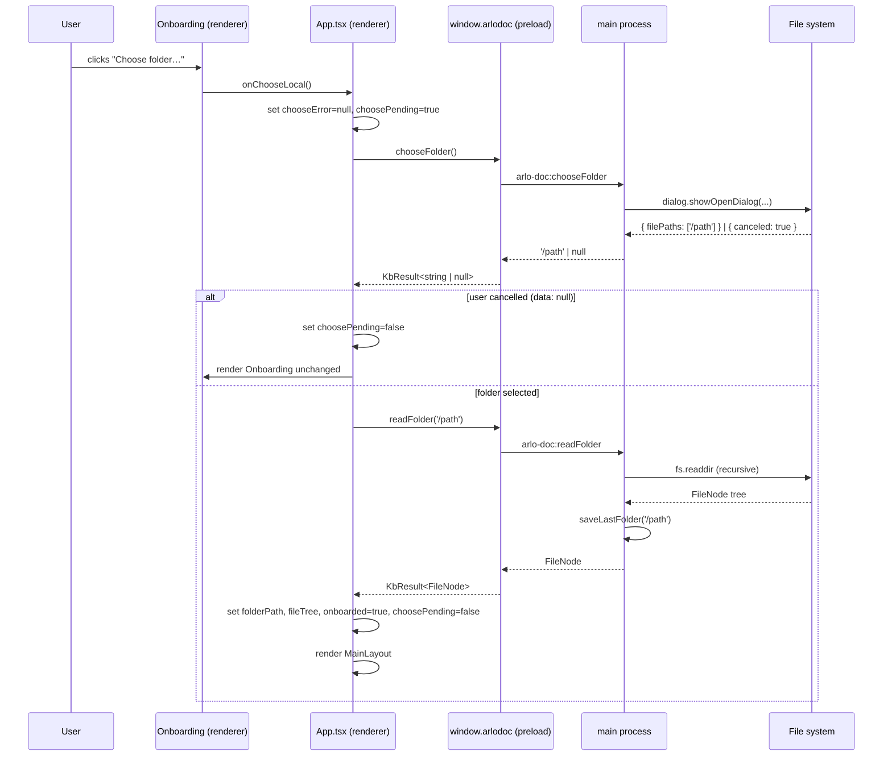
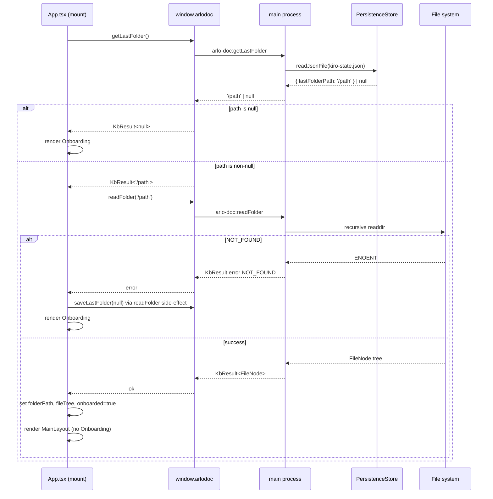
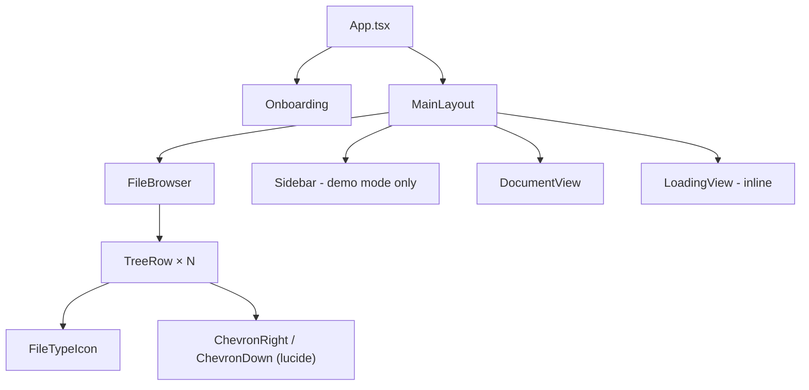

# Design Document: `folder-browser`

## Overview

The `folder-browser` feature turns the stub "Choose folder…" flow in the Arlo onboarding screen into a real, end-to-end local knowledge-base experience. It spans three layers of the monorepo:

1. **Main process** — native OS dialog, recursive folder reading, and JSON persistence via new IPC handlers.
2. **Preload / client bridge** — four new typed IPC methods on `ClientInterface` and `window.arlodoc`.
3. **Renderer** — updated `AppState`, reworked `App.tsx` mount logic, updated `Onboarding`, new `FileBrowser` panel with `FileTypeIcon`, and extended `DocumentView`.

The feature introduces no new external dependencies. It builds exclusively on Electron's built-in `dialog` and `fs` modules plus the project's existing `KbResult<T>` error-handling contract.

---

## Architecture

### Data flow: folder selection



### Data flow: app startup (persisted folder)



### Component hierarchy



---

## Components and Interfaces

### 1. `packages/shared/src/filesystem.ts` (new)

**Purpose:** Single source of truth for the `FileNode` type and the `EXCLUDED_NAMES` constant. Must be importable in all three compilation targets (main, preload, renderer) without any `any` cast.

```typescript
export interface FileNode {
  /** Entry name (basename, not full path). */
  name: string;
  /** Absolute path on disk. */
  path: string;
  kind: 'file' | 'dir';
  /** For files: always []. For dirs: resolved children (empty when depth limit reached). */
  children: FileNode[];
  /**
   * Only meaningful on the root node returned by readFolder.
   * Absolute paths of entries that were skipped due to permission errors.
   */
  skippedPaths: string[];
}

export const EXCLUDED_NAMES: readonly string[] = [
  'node_modules',
  'dist',
  'out',
  '.git',
  '.turbo',
] as const;
```

`packages/shared/src/index.ts` gains one line:
```typescript
export * from './filesystem.js';
```

No Zod schema is needed for `FileNode` — the main process constructs it from `fs.readdir` output, and the renderer receives it as a plain object over IPC.

---

### 2. `packages/client/src/types.ts` — extended `ClientInterface`

Four new methods added to `ClientInterface`:

```typescript
/** Opens the OS native folder picker. Returns null when the user cancels. */
chooseFolder(): Promise<KbResult<string | null>>;

/** Reads a folder recursively and returns the FileNode tree. */
readFolder(folderPath: string): Promise<KbResult<FileNode>>;

/** Returns the last successfully opened folder path, or null if none stored. */
getLastFolder(): Promise<KbResult<string | null>>;

/** Returns the UTF-8 text content of the file at filePath. */
readFile(filePath: string): Promise<KbResult<string>>;
```

`FileNode` is imported from `@arlo-doc/shared`. No `any` types, no `@ts-ignore`.

---

### 3. `packages/client/src/ipc.ts` — four new bindings

The `makeInvoke` helper already wraps all IPC calls in `KbResult`. The four new bindings follow the same pattern:

```typescript
chooseFolder: () =>
  invoke<string | null>('arlo-doc:chooseFolder'),

readFolder: (folderPath: string) =>
  invoke<FileNode>('arlo-doc:readFolder', folderPath),

getLastFolder: () =>
  invoke<string | null>('arlo-doc:getLastFolder'),

readFile: (filePath: string) =>
  invoke<string>('arlo-doc:readFile', filePath),
```

**Important:** `chooseFolder` returns `null` when the user cancels — this is correct, expected behavior, not an error. The main process handler returns `null` (not throws), so `makeInvoke` wraps it as `{ ok: true, data: null }`. No special handling needed in `ipc.ts`.

---

### 4. `apps/desktop/src/main/folderReader.ts` (new)

**Purpose:** Recursively reads a directory and returns a `FileNode` tree. Runs entirely in the main process. Uses `fs/promises`.

```typescript
import { promises as fs } from 'node:fs';
import { join } from 'node:path';
import type { FileNode } from '@arlo-doc/shared';
import { EXCLUDED_NAMES } from '@arlo-doc/shared';

const MAX_DEPTH = 10;

/**
 * Reads folderPath recursively up to MAX_DEPTH levels deep.
 * Hidden entries (name starts with '.') and EXCLUDED_NAMES directories are skipped.
 * Permission errors on individual entries are caught; the entry is appended to
 * root.skippedPaths and processing continues with siblings.
 */
export async function readFolder(folderPath: string): Promise<FileNode> {
  const root: FileNode = {
    name: folderPath.split('/').pop() ?? folderPath,
    path: folderPath,
    kind: 'dir',
    children: [],
    skippedPaths: [],
  };
  await readDirInto(root, folderPath, 0, root.skippedPaths);
  return root;
}

async function readDirInto(
  node: FileNode,
  dirPath: string,
  depth: number,
  skippedPaths: string[],
): Promise<void> {
  if (depth >= MAX_DEPTH) return; // children stay []

  let entries: Awaited<ReturnType<typeof fs.readdir>>;
  try {
    entries = await fs.readdir(dirPath, { withFileTypes: true });
  } catch (err) {
    skippedPaths.push(dirPath);
    return;
  }

  const dirs: FileNode[] = [];
  const files: FileNode[] = [];

  for (const entry of entries) {
    if (entry.name.startsWith('.')) continue;
    if (entry.isDirectory() && (EXCLUDED_NAMES as readonly string[]).includes(entry.name)) continue;

    const entryPath = join(dirPath, entry.name);
    const child: FileNode = {
      name: entry.name,
      path: entryPath,
      kind: entry.isDirectory() ? 'dir' : 'file',
      children: [],
      skippedPaths: [],
    };

    try {
      if (entry.isDirectory()) {
        await readDirInto(child, entryPath, depth + 1, skippedPaths);
        dirs.push(child);
      } else {
        files.push(child);
      }
    } catch (err) {
      skippedPaths.push(entryPath);
    }
  }

  // Sort: dirs first (case-insensitive alpha), then files (case-insensitive alpha)
  const cmp = (a: FileNode, b: FileNode) =>
    a.name.toLowerCase().localeCompare(b.name.toLowerCase());
  dirs.sort(cmp);
  files.sort(cmp);

  node.children = [...dirs, ...files];
}
```

**Error code mapping** (used by the IPC handler wrapping this module):
- `ENOENT` on the root `dirPath` → `NOT_FOUND`
- `EACCES` / `EPERM` on the root `dirPath` → `PERMISSION_DENIED`
- Any error on a child entry → skip + add to `skippedPaths`, do not propagate

---

### 5. `apps/desktop/src/main/persistenceStore.ts` (new)

**Purpose:** Reads and writes `{userData}/kiro-state.json`. The write uses an atomic tmp-rename pattern to avoid partial writes on crash.

```typescript
import { promises as fs } from 'node:fs';
import { join } from 'node:path';
import { app } from 'electron';

interface KiroState {
  lastFolderPath?: string | null;
}

function statePath(): string {
  return join(app.getPath('userData'), 'kiro-state.json');
}

export async function getLastFolder(): Promise<string | null> {
  try {
    const raw = await fs.readFile(statePath(), 'utf-8');
    const parsed = JSON.parse(raw) as KiroState;
    return typeof parsed.lastFolderPath === 'string' ? parsed.lastFolderPath : null;
  } catch {
    // File not found, invalid JSON, or any other error: return null silently
    return null;
  }
}

export async function saveLastFolder(folderPath: string | null): Promise<void> {
  const stateFile = statePath();
  const tmpFile = stateFile + '.tmp';
  try {
    // Merge with existing state to preserve other keys
    let existing: KiroState = {};
    try {
      const raw = await fs.readFile(stateFile, 'utf-8');
      existing = JSON.parse(raw) as KiroState;
    } catch {
      // File absent or corrupt — start fresh
    }
    const next: KiroState = { ...existing, lastFolderPath: folderPath };
    await fs.writeFile(tmpFile, JSON.stringify(next, null, 2), 'utf-8');
    await fs.rename(tmpFile, stateFile); // atomic on all supported platforms
  } catch (err) {
    // Write failure must not surface to the user (REQ-007.1)
    console.error('[PersistenceStore] Failed to save state:', err);
    try { await fs.unlink(tmpFile); } catch { /* ignore cleanup error */ }
  }
}
```

**Key decisions:**
- `JSON.parse` errors are swallowed and return `null` — corrupted state is treated the same as absent state.
- The `rename` call replaces any existing file atomically on POSIX and Windows NTFS (since Node 14+, `fs.rename` on Windows is atomic when source and destination are on the same drive).
- `saveLastFolder` never throws; the caller (IPC handler) need not wrap it separately.

---

### 6. `apps/desktop/src/main/index.ts` — four new IPC handlers

Added after the existing handlers, following the exact same `ipcMain.handle` / `wrapError` pattern. Error code classification:

```typescript
import { dialog } from 'electron';
import { promises as fs } from 'node:fs';
import { readFolder } from './folderReader.js';
import { getLastFolder, saveLastFolder } from './persistenceStore.js';

// Helper: maps Node.js errno codes to KbErrorCode
function nodeErrCode(err: unknown): string {
  const code = (err as NodeJS.ErrnoException).code;
  if (code === 'ENOENT') return 'NOT_FOUND';
  if (code === 'EACCES' || code === 'EPERM') return 'PERMISSION_DENIED';
  return 'UNKNOWN';
}

ipcMain.handle('arlo-doc:chooseFolder', async (event) => {
  const win = BrowserWindow.fromWebContents(event.sender);
  const result = await dialog.showOpenDialog(win ?? BrowserWindow.getFocusedWindow()!, {
    properties: ['openDirectory'],
    title: 'Choose a folder for your knowledge base',
  });
  // Cancelled: return null (NOT an error — REQ-002.5, REQ-002.8)
  if (result.canceled || result.filePaths.length === 0) return null;
  return result.filePaths[0];
});

ipcMain.handle('arlo-doc:readFolder', async (event, folderPath: string) => {
  try {
    const tree = await readFolder(folderPath);
    // Best-effort persistence — failure must not block the response (REQ-007.1)
    void saveLastFolder(folderPath);
    return tree;
  } catch (err) {
    const code = nodeErrCode(err);
    const wrapped = new Error((err as Error).message) as Error & { kbError: unknown };
    wrapped.kbError = { code, message: (err as Error).message };
    throw wrapped;
  }
});

ipcMain.handle('arlo-doc:getLastFolder', async () => {
  try {
    return await getLastFolder();
  } catch (err) {
    wrapError(err);
  }
});

ipcMain.handle('arlo-doc:readFile', async (event, filePath: string) => {
  try {
    return await fs.readFile(filePath, 'utf-8');
  } catch (err) {
    const code = nodeErrCode(err);
    const wrapped = new Error((err as Error).message) as Error & { kbError: unknown };
    wrapped.kbError = { code, message: (err as Error).message };
    throw wrapped;
  }
});
```

**Note on `chooseFolder`:** This handler does **not** use `wrapError`. A cancelled dialog returns `null` — a legitimate success value. `wrapError` is only invoked on unexpected exceptions.

---

### 7. `apps/desktop/src/renderer/src/types.ts` — extended `AppState`

```typescript
import type { FileNode } from '@arlo-doc/shared';

export interface AppState {
  // Routing
  viewMode: ViewMode;
  modal: ModalKind;
  showChat: boolean;

  // Draft
  draftStatus: DraftStatus;
  draftName: string;

  // Tabs
  tabs: Tab[];
  activeTabId: string;

  // Sidebar (demo mode - static notebooks)
  activeNoteId: string;
  expandedNotebooks: string[];

  // Post-approval message
  lastApprovalResult: 'approved' | 'declined' | null;

  // ── Folder browser (new fields) ───────────────────────────────────────
  /** Absolute path of the currently open folder, or null in demo mode. */
  folderPath: string | null;
  /** FileNode root returned by the last successful readFolder call. */
  fileTree: FileNode | null;
  /** Absolute path of the file currently displayed in the main area. */
  activeFilePath: string | null;
  /** UTF-8 text content of the currently open file. */
  fileContent: string | null;
  /** True while arlo-doc:readFile is in-flight. */
  fileLoading: boolean;
  /** Directory paths currently expanded in FileBrowser. */
  expandedPaths: string[];
}
```

`INITIAL_STATE` in `App.tsx` adds:
```typescript
folderPath: null,
fileTree: null,
activeFilePath: null,
fileContent: null,
fileLoading: false,
expandedPaths: [],
```

---

### 8. `apps/desktop/src/renderer/src/App.tsx` — wired folder state

**New state tracking (local, not in `AppState`):**
```typescript
const [choosePending, setChoosePending] = useState(false);
const [chooseError, setChooseError] = useState<string | null>(null);
```

**Mount effect — auto-onboard from persistence:**
```typescript
useEffect(() => {
  if (onboarded) return;
  void (async () => {
    const lastResult = await window.arlodoc.getLastFolder();
    if (!lastResult.ok || lastResult.data == null) return;
    const treeResult = await window.arlodoc.readFolder(lastResult.data);
    if (!treeResult.ok) {
      // Path no longer valid — persistence will be cleared on next readFolder call
      return;
    }
    update({ folderPath: lastResult.data, fileTree: treeResult.data });
    setOnboarded(true);
  })();
}, []);
```

**`handleChooseFolder`:**
```typescript
const handleChooseFolder = useCallback(async () => {
  setChoosePending(true);
  setChooseError(null);
  try {
    const chosen = await window.arlodoc.chooseFolder();
    if (!chosen.ok) {
      setChooseError(chosen.error.message);
      return;
    }
    if (chosen.data == null) return; // user cancelled — no state change
    const tree = await window.arlodoc.readFolder(chosen.data);
    if (!tree.ok) {
      setChooseError(tree.error.message);
      return;
    }
    update({ folderPath: chosen.data, fileTree: tree.data });
    setOnboarded(true);
  } finally {
    setChoosePending(false);
  }
}, [update]);
```

**`handleFileClick`:**
```typescript
const handleFileClick = useCallback(async (filePath: string) => {
  update({ fileLoading: true, activeFilePath: filePath });
  const result = await window.arlodoc.readFile(filePath);
  if (!result.ok) {
    update({ fileLoading: false, activeFilePath: null, fileContent: null });
    // Store error for display — see DocumentView fallback
    return;
  }
  update({ fileLoading: false, fileContent: result.data });
}, [update]);
```

**`handleDirectoryToggle`:**
```typescript
const handleDirectoryToggle = useCallback((dirPath: string) => {
  setState((s) => {
    const next = s.expandedPaths.includes(dirPath)
      ? s.expandedPaths.filter((p) => p !== dirPath)
      : [...s.expandedPaths, dirPath];
    return { ...s, expandedPaths: next };
  });
}, []);
```

`handleChooseFolder` is passed as `onChooseLocal` to `Onboarding`. `choosePending` and `chooseError` are also passed.

---

### 9. `apps/desktop/src/renderer/src/screens/Onboarding.tsx` — updated props

```typescript
interface OnboardingProps {
  onChooseLocal: () => void;
  onChooseGitHub: () => void;
  isPending?: boolean;
  error?: string | null;
}
```

Changes to the "Personal knowledge base" card:
- Button label becomes `"Opening…"` when `isPending` is true.
- Button `disabled` attribute is `true` when `isPending` is true; style adds `opacity: 0.6, cursor: 'not-allowed'`.
- An error paragraph appears below both cards when `error` is non-null:

```tsx
{error && (
  <p style={{
    fontSize: 12.5,
    color: '#c0392b',
    fontFamily: 'var(--font-sans)',
    textAlign: 'center',
    marginTop: 8,
  }}>
    {error}
  </p>
)}
```

---

### 10. `apps/desktop/src/renderer/src/screens/MainLayout.tsx` — FileBrowser slot

**New props added to `MainLayoutProps`:**
```typescript
onFileClick: (path: string) => void;
onDirectoryToggle: (path: string) => void;
```

**Sidebar conditional:**
```tsx
{state.fileTree ? (
  <FileBrowser
    fileTree={state.fileTree}
    expandedPaths={state.expandedPaths}
    activeFilePath={state.activeFilePath}
    onFileClick={onFileClick}
    onDirectoryToggle={onDirectoryToggle}
    isLoading={state.fileLoading}
  />
) : (
  <Sidebar
    variant={sidebarVariant}
    activeNoteId={state.activeNoteId}
    expandedNotebooks={state.expandedNotebooks}
    onNoteClick={onNoteClick}
    onNotebookToggle={onNotebookToggle}
  />
)}
```

**Content area conditional:**
```tsx
{state.fileLoading ? (
  <LoadingView />
) : state.fileContent != null && state.activeFilePath != null ? (
  <DocumentView
    activeNoteId={state.activeNoteId}
    fileContent={state.fileContent}
    activeFilePath={state.activeFilePath}
  />
) : (
  <DocumentView activeNoteId={state.activeNoteId} />
)}
```

**`LoadingView`** (inline component in `MainLayout.tsx`):
```tsx
function LoadingView(): React.ReactElement {
  return (
    <div style={{ flex: 1, display: 'flex', alignItems: 'center', justifyContent: 'center' }}>
      <span style={{ fontSize: 13, color: '#8e8eaa', fontFamily: 'var(--font-sans)' }}>
        Loading…
      </span>
    </div>
  );
}
```

---

### 11. `apps/desktop/src/renderer/src/components/FileTypeIcon.tsx` (new)

**Props:**
```typescript
interface FileTypeIconProps {
  fileName: string;
}
```

**Extension extraction** (no `node:path` in renderer):
```typescript
function getExtension(fileName: string): string {
  const lastDot = fileName.lastIndexOf('.');
  // No dot, or the dot is the very first character (e.g. ".gitignore") → no extension
  if (lastDot <= 0) return '';
  return fileName.slice(lastDot).toLowerCase();
}
```

**Icon mapping:**

| Extension(s) | `data-icon` |
|---|---|
| `.md`, `.mdx` | `markdown` |
| `.ts`, `.tsx` | `typescript` |
| `.js`, `.jsx`, `.mjs` | `javascript` |
| `.json` | `json` |
| `.yml`, `.yaml` | `yaml` |
| `.png`, `.jpg`, `.jpeg`, `.gif`, `.svg`, `.webp` | `image` |
| `.sh`, `.bash` | `shell` |
| `.txt` | `text` |
| *(all others, empty string)* | `generic` |

All icons are 14×14 px inline SVGs with `xmlns="http://www.w3.org/2000/svg"`, `width="14"`, `height="14"`, `viewBox="0 0 14 14"`. Stroke colors use the design token palette.

**Complete SVG path data for all 9 icons:**

```
markdown  (data-icon="markdown")
  Document outline with "M↓" indicator — a rect with a down-arrow path inside.
  <rect x="1" y="1" width="9" height="12" rx="1" stroke="#64648c" stroke-width="1.2" fill="none"/>
  <path d="M3 5h6M3 7.5l1.5 2L6 7.5l1.5 2L9 7.5" stroke="#64648c" stroke-width="1.1" fill="none" stroke-linecap="round" stroke-linejoin="round"/>

typescript  (data-icon="typescript")
  Rounded square badge with "TS" lettermark lines.
  <rect x="1" y="1" width="12" height="12" rx="2.5" fill="#3178C6"/>
  <path d="M3.5 7h4M5.5 5v6" stroke="#fff" stroke-width="1.3" stroke-linecap="round"/>
  <path d="M8.5 8.5c0-.8.5-1.5 1.5-1.5s1.5.7 1.5 1.5-.5 1.5-1.5 1.5" stroke="#fff" stroke-width="1.1" fill="none" stroke-linecap="round"/>

javascript  (data-icon="javascript")
  Yellow rounded badge with "JS" lettermark lines.
  <rect x="1" y="1" width="12" height="12" rx="2.5" fill="#F7DF1E"/>
  <path d="M5 9.5c0 1-1 1.5-2 1" stroke="#1a1a2e" stroke-width="1.2" stroke-linecap="round"/>
  <path d="M8.5 5v5c0 1.5 3 1.5 3 0" stroke="#1a1a2e" stroke-width="1.2" stroke-linecap="round"/>

json  (data-icon="json")
  Curly brace pair indicating JSON syntax.
  <path d="M4.5 2c-1 0-1.5.5-1.5 1.5v1c0 .8-.5 1.5-1 1.5.5 0 1 .7 1 1.5v1c0 1 .5 1.5 1.5 1.5" stroke="#64648c" stroke-width="1.2" fill="none" stroke-linecap="round"/>
  <path d="M9.5 2c1 0 1.5.5 1.5 1.5v1c0 .8.5 1.5 1 1.5-.5 0-1 .7-1 1.5v1c0 1-.5 1.5-1.5 1.5" stroke="#64648c" stroke-width="1.2" fill="none" stroke-linecap="round"/>

yaml  (data-icon="yaml")
  Three horizontal lines of decreasing width suggesting structured indentation.
  <path d="M2 4h10M2 7h7M2 10h5" stroke="#64648c" stroke-width="1.3" stroke-linecap="round"/>

image  (data-icon="image")
  Rectangle frame with mountain-and-sun landscape inside.
  <rect x="1" y="2" width="12" height="10" rx="1.5" stroke="#64648c" stroke-width="1.2" fill="none"/>
  <circle cx="4.5" cy="5.5" r="1" fill="#64648c"/>
  <path d="M1.5 10.5l3-3.5 2.5 3 2-2 3 3.5" stroke="#64648c" stroke-width="1.1" fill="none" stroke-linejoin="round"/>

shell  (data-icon="shell")
  Terminal prompt chevron and underscore cursor.
  <rect x="1" y="2" width="12" height="10" rx="1.5" stroke="#64648c" stroke-width="1.2" fill="none"/>
  <path d="M3.5 9l2.5-2L3.5 5" stroke="#64648c" stroke-width="1.2" fill="none" stroke-linecap="round" stroke-linejoin="round"/>
  <path d="M8 9h3" stroke="#64648c" stroke-width="1.2" stroke-linecap="round"/>

text  (data-icon="text")
  Document outline with four horizontal lines representing text content.
  <rect x="1.5" y="1" width="9" height="12" rx="1" stroke="#64648c" stroke-width="1.2" fill="none"/>
  <path d="M3.5 4.5h5M3.5 7h5M3.5 9.5h3" stroke="#64648c" stroke-width="1.1" stroke-linecap="round"/>

generic  (data-icon="generic")
  Plain document outline, no interior detail — the fallback icon.
  <path d="M3 1h6l3 3v9a1 1 0 0 1-1 1H3a1 1 0 0 1-1-1V2a1 1 0 0 1 1-1z" stroke="#a8a8be" stroke-width="1.2" fill="none"/>
  <path d="M9 1v3h3" stroke="#a8a8be" stroke-width="1.2" fill="none"/>
```

The `typescript` and `javascript` icons use filled colored backgrounds to match real IDE conventions, making them visually distinct from the stroke-only icons and easily identifiable at 14px.

---

### 12. `apps/desktop/src/renderer/src/components/FileBrowser.tsx` (new)

**Props:**
```typescript
interface FileBrowserProps {
  fileTree: FileNode;
  expandedPaths: string[];
  activeFilePath: string | null;
  onFileClick: (path: string) => void;
  onDirectoryToggle: (path: string) => void;
  isLoading?: boolean;
}
```

**Flat-render algorithm:**

The component pre-computes a flat array of `{ node: FileNode, depth: number }` pairs from the tree before rendering. This avoids deeply nested JSX and makes the depth/indent calculation straightforward.

```typescript
interface FlatRow {
  node: FileNode;
  depth: number;
}

function flattenVisible(nodes: FileNode[], depth: number, expandedPaths: string[]): FlatRow[] {
  const rows: FlatRow[] = [];
  for (const node of nodes) {
    rows.push({ node, depth });
    if (node.kind === 'dir' && expandedPaths.includes(node.path)) {
      rows.push(...flattenVisible(node.children, depth + 1, expandedPaths));
    }
  }
  return rows;
}
```

**Structure:**
```tsx
<div style={{ width: 240, flexShrink: 0, background: '#f8f8fc', borderRight: '1px solid rgba(0,0,0,.06)', display: 'flex', flexDirection: 'column', overflow: 'hidden' }}>
  {/* Header: folder basename */}
  <div style={{ padding: '10px 16px 6px', fontSize: 11, fontWeight: 500, color: '#8e8eaa', fontFamily: 'var(--font-sans)', letterSpacing: '0.06em', textTransform: 'uppercase', flexShrink: 0 }}>
    {folderBasename}
  </div>

  {/* Scrollable tree body */}
  <div style={{ flex: 1, overflowY: 'auto', padding: '0 8px' }}>
    {flatRows.map(({ node, depth }) => (
      <TreeRow key={node.path} node={node} depth={depth} ... />
    ))}
  </div>
</div>
```

**`TreeRow` sub-component:**

```typescript
interface TreeRowProps {
  node: FileNode;
  depth: number;
  isExpanded: boolean;
  isActive: boolean;
  isHovered: boolean;
  isLoading: boolean;
  onMouseEnter: () => void;
  onMouseLeave: () => void;
  onClick: () => void;
}
```

Layout per row:
- Outer `div`: height 26px, `paddingLeft: 8 + depth * 12` px, borderRadius 6px, background computed from `isActive`/`isHovered`
- Dir rows: `ChevronDown` (expanded) or `ChevronRight` (collapsed) at 12px, gap 4px, then name label
- File rows: `FileTypeIcon` at 14px, gap 4px, then name label
- When `isLoading`: `pointerEvents: 'none'`, `opacity: 0.6` on the entire row

**Active file style:** `background: rgba(88,86,214,.08)`, `color: #5856D6`, `fontWeight: 500`
**Hover style (non-active):** `background: rgba(88,86,214,.04)`
**Hovered path** tracked via `useState<string | null>(null)` in `FileBrowser`.

---

### 13. `apps/desktop/src/renderer/src/components/DocumentView.tsx` — extended for real files

**Updated props:**
```typescript
interface DocumentViewProps {
  activeNoteId: string;
  /** When non-null, renders this content instead of the hardcoded demo note. */
  fileContent?: string | null;
  /** The absolute file path — used to determine rendering mode (.md vs other). */
  activeFilePath?: string | null;
}
```

**Rendering decision:**
```typescript
function isMarkdownPath(filePath: string): boolean {
  const lower = filePath.toLowerCase();
  return lower.endsWith('.md') || lower.endsWith('.mdx');
}
```

```tsx
if (fileContent != null && activeFilePath != null) {
  if (isMarkdownPath(activeFilePath)) {
    // Styled markdown: whitespace-pre-wrap in a readable prose block
    return (
      <div style={{ flex: 1, overflowY: 'auto', background: '#fff', display: 'flex', justifyContent: 'center' }}>
        <div style={{ width: '100%', maxWidth: 720, padding: '48px 40px' }}>
          <pre style={{ whiteSpace: 'pre-wrap', fontFamily: 'var(--font-sans)', fontSize: 15, lineHeight: 1.7, color: '#1a1a2e' }}>
            {fileContent}
          </pre>
        </div>
      </div>
    );
  } else {
    // Plain file: monospace pre with horizontal scroll
    return (
      <div style={{ flex: 1, overflowY: 'auto', background: '#fff' }}>
        <pre style={{ padding: '32px 40px', fontFamily: 'var(--font-mono)', fontSize: 13, color: '#1a1a2e', lineHeight: 1.6, overflowX: 'auto', margin: 0 }}>
          {fileContent}
        </pre>
      </div>
    );
  }
}
// Fallback: existing demo-note rendering
```

The fallback branch continues to work exactly as before, so demo mode (no real folder open) is unaffected.

---

## Data Models

### FileNode (canonical)

```
FileNode {
  name:         string          // basename, e.g. "README.md"
  path:         string          // absolute, e.g. "/Users/joe/docs/README.md"
  kind:         'file' | 'dir'
  children:     FileNode[]      // always [] for files; [] when dir is at max depth or empty
  skippedPaths: string[]        // only populated on root; paths skipped due to EACCES
}
```

### KiroState (persistence)

```json
{
  "lastFolderPath": "/Users/joe/docs"
}
```

Stored at `{app.getPath('userData')}/kiro-state.json`. Keys other than `lastFolderPath` may coexist and are preserved on write.

### AppState additions

```
folderPath:    string | null   // null = demo mode
fileTree:      FileNode | null // null = demo mode / not yet loaded
activeFilePath: string | null  // null = no file open
fileContent:   string | null   // null = no file open
fileLoading:   boolean         // true while readFile is in-flight
expandedPaths: string[]        // paths of expanded directories in FileBrowser
```

---

## Correctness Properties
*A property is a characteristic or behavior that should hold true across all valid executions of a system — essentially, a formal statement about what the system should do. Properties serve as the bridge between human-readable specifications and machine-verifiable correctness guarantees.*
### Property 1: Folder selection state transition
*For any* non-null absolute folder path returned by `chooseFolder`, after the `handleChooseFolder` callback resolves, `AppState.folderPath` SHALL equal that path and `onboarded` SHALL be `true`. *Property class: state-transition invariant.*
**Validates: Requirements REQ-001.2**
### Property 2: Folder selection error propagation
*For any* error returned by `chooseFolder` or `readFolder` (i.e., `ok: false` result), the `chooseError` state SHALL be a non-empty string and `choosePending` SHALL be `false` after the handler resolves. *Property class: error-condition invariant.*
**Validates: Requirements REQ-001.4**
### Property 3: HiddenFilter exclusion invariant
*For any* `FileNode` tree produced by `FolderReader`, no node anywhere in the tree (at any depth) SHALL have a `name` that begins with `.` or a `name` that is a member of `EXCLUDED_NAMES`. *Property class: invariant.*
**Validates: Requirements REQ-003.2, REQ-003.3**
### Property 4: Tree sort invariant
*For any* `FileNode` of `kind: 'dir'` in a tree produced by `FolderReader`, its `children` array SHALL satisfy: all `kind: 'dir'` entries appear before all `kind: 'file'` entries, and within each group the entries are ordered by `name.toLowerCase()`. *Property class: invariant.*
**Validates: Requirements REQ-003.4**
### Property 5: Max-depth bound
*For any* `FileNode` tree produced by `FolderReader`, no node in the tree SHALL be reachable at a depth greater than 10, where the root node returned by `readFolder` is at depth 0. *Property class: invariant / bound.*
**Validates: Requirements REQ-003.5**
### Property 6: IPC channel forwarding
*For any* string `path`, calling `window.arlodoc.readFolder(path)` SHALL invoke exactly the IPC channel `'arlo-doc:readFolder'` with `path` as the first argument — no other channel is called and the argument is not transformed. *Property class: round-trip / identity.*
**Validates: Requirements REQ-002.5**
### Property 7: FileBrowser expansion visibility
*For any* `FileNode` tree and any set of `expandedPaths`, the visible rows rendered by `FileBrowser` SHALL be exactly: all root children, plus all children of every directory node whose `path` is in `expandedPaths` (recursively applied). No other nodes SHALL appear. *Property class: invariant.*
**Validates: Requirements REQ-004.3, REQ-004.4, REQ-004.5**
### Property 8: FileTypeIcon totality
*For any* `fileName` string, `FileTypeIcon` SHALL render an SVG element whose `data-icon` attribute is a non-empty string. The component SHALL never return `null`, `undefined`, or an element without a `data-icon` attribute. *Property class: totality / exhaustiveness.*
**Validates: Requirements REQ-005.1, REQ-005.2, REQ-005.3**
### Property 9: FileTypeIcon case-insensitivity
*For any* `fileName` whose extension belongs to a known group, changing the case of the extension characters SHALL produce the same `data-icon` value (e.g., `file.MD`, `file.md`, `file.Md` all produce `data-icon="markdown"`). *Property class: invariant.*
**Validates: Requirements REQ-005.2**
### Property 10: File content rendering mode
*For any* `fileContent` string and `activeFilePath` that ends with `.md` or `.mdx`, `DocumentView` SHALL NOT render the content in a `<pre>` element with monospace font. For any `fileContent` string and `activeFilePath` with any other extension, `DocumentView` SHALL render the content inside a `<pre>` element. *Property class: conditional invariant.*
**Validates: Requirements REQ-006.3, REQ-006.4**
### Property 11: Persistence round-trip
*For any* absolute folder path string `p`, calling `saveLastFolder(p)` followed by `getLastFolder()` SHALL return `p` unchanged. *Property class: round-trip.*
**Validates: Requirements REQ-007.1, REQ-007.2**


## Error Handling

### Error code taxonomy

| Node.js errno | `KbErrorCode`        | Condition |
|---|---|---|
| `ENOENT`       | `NOT_FOUND`          | Path does not exist on disk |
| `EACCES`/`EPERM` | `PERMISSION_DENIED` | Process lacks read permission |
| *(any other)*  | `UNKNOWN`            | Unexpected failure |
| *(dialog cancelled)* | — (not an error) | `arlo-doc:chooseFolder` returns `null` with `ok: true` |

### Per-handler behavior

**`arlo-doc:chooseFolder`**
- Returns `null` (not throws) on cancellation → `{ ok: true, data: null }` in renderer.
- Unexpected `dialog` errors bubble up through the standard `wrapError` path.

**`arlo-doc:readFolder`**
- `ENOENT` / `EACCES` on the root path → structured `KbError`, not thrown via `wrapError` directly (the handler applies `nodeErrCode` before attaching `.kbError`).
- Per-entry permission errors → entry appended to `skippedPaths`, siblings continue, no error returned to caller.

**`arlo-doc:readFile`**
- Same `ENOENT` / `EACCES` → `NOT_FOUND` / `PERMISSION_DENIED` mapping.
- Renderer: error displayed in main content area; `activeFilePath` and `fileContent` both set to `null`.

**`arlo-doc:getLastFolder`**
- `PersistenceStore` never throws; returns `null` on any read failure.
- The IPC handler wraps via `wrapError` as a safety net, but in practice this path is unreachable unless the store function itself throws unexpectedly.

### Renderer-side error surfaces

| Scenario | Surface |
|---|---|
| `chooseFolder` IPC error | Inline text below Onboarding cards |
| `readFolder` during onboard flow | Inline text below Onboarding cards |
| `readFile` failure | Error text in main content area; FileBrowser returns to normal state |
| Auto-onboard `readFolder` fails with `NOT_FOUND` | Silent: show Onboarding (persisted path silently invalidated) |

---

## Testing Strategy

### Unit tests

Each new module gets its own test file:

- **`folderReader.test.ts`** — uses `memfs` or a real temp directory to test: filtering, sorting, max-depth truncation, per-entry error handling (mock `fs.readdir` to throw `EACCES` for specific entries), `NOT_FOUND` on non-existent root.
- **`persistenceStore.test.ts`** — write/read round-trip, missing file returns null, corrupt JSON returns null, write failure does not throw.
- **`FileTypeIcon.test.tsx`** — each extension in the table, case variants, no-extension filenames, dot-only filenames.
- **`FileBrowser.test.tsx`** — flat-render output for various trees and `expandedPaths` combinations, click handlers called with correct paths, active file row styling, loading state disables interaction.
- **`DocumentView.test.tsx`** — markdown path renders in prose element, non-markdown path renders in `<pre>`, fallback to demo notes when `fileContent` is null.

### Property-based tests

Property-based testing library: **[fast-check](https://github.com/dubzzz/fast-check)** (TypeScript-native, no extra setup needed).

Each property test runs a minimum of **100 iterations**.

| Property | Module | fast-check arbitraries |
|---|---|---|
| P3 HiddenFilter exclusion | `folderReader` | Arbitrary dir trees with random names including dot-prefixed and EXCLUDED_NAMES entries |
| P4 Tree sort invariant | `folderReader` | Arbitrary mixtures of files and dirs with random names per level |
| P5 Max-depth bound | `folderReader` | Deeply nested dir structures (depth > 10) |
| P7 FileBrowser visibility | `FileBrowser` | Arbitrary `FileNode` trees + arbitrary `expandedPaths` subsets |
| P8 FileTypeIcon totality | `FileTypeIcon` | `fc.string()` for arbitrary filenames |
| P9 FileTypeIcon case-insensitivity | `FileTypeIcon` | `fc.constantFrom(...knownExtensions)` + `fc.string({ unit: 'grapheme' })` for random casing |
| P10 File content rendering mode | `DocumentView` | `fc.string()` for content + `fc.string()` for path; classify by extension |
| P11 Persistence round-trip | `persistenceStore` | `fc.string({ minLength: 1 })` prefixed with `/` to form valid-ish paths |

Tag format for each test:
```typescript
// Feature: folder-browser, Property N: <property_text>
```

### Integration tests

- Full IPC round-trip test using Electron's `spectron` or a headless Electron test harness: choose folder → read folder → verify `FileBrowser` renders tree; click file → verify content shown.
- IPC error contract test: inject errors into `readFolder` handler, verify `invoke` wrapper returns `{ ok: false, error: { code, message } }` — never an unhandled rejection.

### TypeScript verification

```bash
electron-vite typecheck
```

Must pass with zero errors across all three compilation targets (main, preload, renderer) after all changes.
