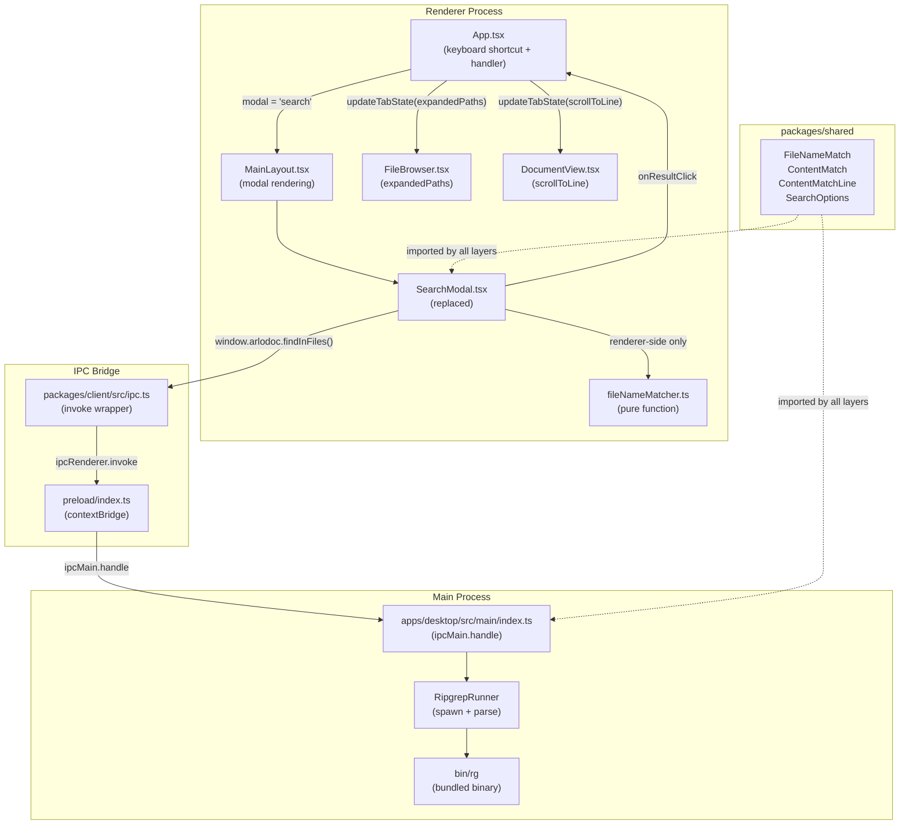

# Design Document: Search Bar

## Overview

The search-bar feature adds a global search modal to the Arlo desktop application, activated via `Cmd+Shift+F` (macOS) or `Ctrl+Shift+F` (Windows/Linux). The modal provides two complementary search modes in a single overlay:

- **Search Files** — fuzzy file-name matching against the active tab's in-memory `FileNode` tree, running entirely in the renderer process with 150 ms debounce.
- **Find in Files** — full-text content search powered by a bundled `rg` (ripgrep) binary, executed in the main process via IPC, triggered only on `Enter`.

Both modes share a single `SearchModal` component. The existing `SearchModal` component is a design stub (static data); this feature replaces it entirely with a fully functional implementation. Everything integrates with the existing `WorktreeTabState` / `AppState` architecture from the worktree tab editor: results open files in the active tab, `scrollToLine` navigates to matching lines, and `expandedPaths` expands ancestor directories in `FileBrowser`.

The feature touches four layers:

1. **`packages/shared`** — four new exported interfaces: `FileNameMatch`, `ContentMatchLine`, `ContentMatch`, `SearchOptions`.
2. **`apps/desktop/src/main`** — a new `RipgrepRunner` module and two new `ipcMain` handlers: `arlo-doc:searchFiles` and `arlo-doc:findInFiles`.
3. **`packages/client`** — two new `ClientInterface` methods and their `ipc.ts` bindings.
4. **`apps/desktop/src/renderer`** — replaced `SearchModal` component, keyboard-shortcut wiring in `App.tsx`, `handleSearchResultClick` handler, and `WorktreeTabState.scrollToLine` field.

---

## Architecture



### Key Design Decisions

**Renderer-side file-name matching**: File-name search requires no IPC round-trip because the active tab's `fileTree` is already in renderer memory. A pure `fileNameMatcher.ts` module operates on the flattened leaf list derived from `fileTree`. This keeps latency negligible (sub-millisecond for typical repo sizes of ≤ 10 000 files).

**Enter-triggered content search**: ripgrep scans disk, so it cannot be debounced the same way as the in-memory matcher. Restricting invocation to `Enter`-key or an explicit button keeps the experience predictable and avoids spawning many `rg` processes.

**Bundled ripgrep**: Users should not need ripgrep on their system. The binary is included in `extraResources` via `electron-builder.yml`. A `RG_PATH` environment variable override supports development and CI without unpacking the bundle.

**`scrollToLine` in `WorktreeTabState`**: The `DocumentView` needs to know which line to scroll to and highlight after a search result opens a file. Adding `scrollToLine: number | null` to `WorktreeTabState` follows the established per-tab state pattern.

---

## Components and Interfaces

### 1. `packages/shared/src/types/search.ts` (new file)

```typescript
export interface FileNameMatch {
  /** Absolute path on disk. */
  filePath: string;
  /** Base name only (e.g. "index.ts"). */
  fileName: string;
}

export interface ContentMatchLine {
  /** 1-indexed line number. */
  lineNumber: number;
  /** Raw text content of the line. */
  text: string;
  /** true = matched line; false = context line (±2 surrounding lines). */
  isMatch: boolean;
}

export interface ContentMatch {
  /** Absolute path on disk. */
  filePath: string;
  lines: ContentMatchLine[];
}

export interface SearchOptions {
  caseSensitive: boolean;
  useRegex: boolean;
}
```

All four types are re-exported from `packages/shared/src/index.ts`.

---

### 2. `packages/shared/src/index.ts` additions

```typescript
export type { FileNameMatch, ContentMatchLine, ContentMatch, SearchOptions } from "./types/search.js";
```

---

### 3. `apps/desktop/src/renderer/src/types.ts` changes

`WorktreeTabState` gains one required field:

```typescript
export interface WorktreeTabState {
  // ...existing fields...
  /** Line to scroll to and highlight after a search result opens this file.
   *  1-indexed. null = no scroll target. */
  scrollToLine: number | null;
}

export const EMPTY_TAB_STATE: WorktreeTabState = {
  // ...existing defaults...
  scrollToLine: null,
};
```

---

### 4. `packages/client/src/types.ts` — `ClientInterface` additions

```typescript
import type { SearchOptions, FileNameMatch, ContentMatch } from "@arlo-doc/shared";

export interface ClientInterface {
  // ...existing methods...

  /** Fuzzy file-name search (NOTE: main process implementation exists for
   *  symmetry and future server use; renderer uses renderer-side matcher directly). */
  searchFiles(
    repoDir: string,
    query: string,
    options: SearchOptions,
  ): Promise<KbResult<FileNameMatch[]>>;

  /** Full-text content search via ripgrep. */
  findInFiles(
    repoDir: string,
    query: string,
    options: SearchOptions,
  ): Promise<KbResult<ContentMatch[]>>;
}
```

`KbErrorCode` gains two new members for completeness (already covered by `UNKNOWN` but made explicit):

```typescript
export type KbErrorCode =
  | "NOT_FOUND"
  | "PERMISSION_DENIED"
  | "CONFLICT"
  | "GIT_ERROR"
  | "AGENT_ERROR"
  | "CONTAINMENT_ERROR"
  | "AUTH_ERROR"
  | "TIMEOUT"       // new — ripgrep timed out
  | "UNKNOWN";
```

---

### 5. `packages/client/src/ipc.ts` additions

```typescript
searchFiles: (repoDir: string, query: string, options: SearchOptions) =>
  invoke<FileNameMatch[]>("arlo-doc:searchFiles", repoDir, query, options),

findInFiles: (repoDir: string, query: string, options: SearchOptions) =>
  invoke<ContentMatch[]>("arlo-doc:findInFiles", repoDir, query, options),
```

---

### 6. `apps/desktop/src/main/ripgrepRunner.ts` (new file)

Responsible for binary resolution, process spawning, timeout enforcement, and output parsing.

```typescript
import { promises as fs } from "node:fs";
import { spawn } from "node:child_process";
import { app } from "electron";
import { join } from "node:path";
import type { ContentMatch, ContentMatchLine, SearchOptions } from "@arlo-doc/shared";
import type { KbResult } from "@arlo-doc/client";

export const DEFAULT_EXCLUDES = ["node_modules", ".git", "dist", "build"] as const;
const TIMEOUT_MS = 30_000;
const MAX_FILES = 20;
const MAX_MATCH_LINES = 100; // across all files

export function resolveRgBinary(): string {
  if (process.env.RG_PATH) return process.env.RG_PATH;
  const platform = process.platform;
  const base = app.getAppPath();
  return platform === "win32" ? join(base, "bin", "rg.exe") : join(base, "bin", "rg");
}

export async function findInFiles(
  repoDir: string,
  query: string,
  options: SearchOptions,
): Promise<KbResult<ContentMatch[]>>;
```

**Binary resolution logic** (REQ-005.1–2):

1. If `process.env.RG_PATH` is set, use that value as the binary path with no fallback. If the file does not exist at that path, return `NOT_FOUND` immediately.
2. Otherwise, resolve `{app.getAppPath()}/bin/rg` (macOS/Linux) or `{app.getAppPath()}\bin\rg.exe` (Windows).
3. If the resolved path does not exist on disk, return `NOT_FOUND` without spawning.

**Spawn arguments** (REQ-004.3–5):

```
rg --json --context 2 --max-count 5
   --glob '!{node_modules,.git,dist,build}'
   [--ignore-case]          // if caseSensitive = false
   [--fixed-strings]        // if useRegex = false
   <query>
```

Process `cwd` is set to `repoDir`. Environment is `{ PATH: process.env.PATH }` only (REQ-005.4).

**Timeout** (REQ-005.5): A 30-second `setTimeout` kills the process and returns `TIMEOUT` error.

**Output parsing**: `rg --json` emits NDJSON where each line is one of:
- `{"type":"begin","data":{"path":{...}}}` — new file block starts
- `{"type":"match","data":{"path":{...},"lines":{...},"line_number":N,...}}` — a matched line
- `{"type":"context","data":{"path":{...},"lines":{...},"line_number":N,...}}` — a context line
- `{"type":"end","data":{...}}` — file block ends
- `{"type":"summary",...}` — final summary (ignored)

The parser accumulates `ContentMatch` entries per file. Truncation is applied: once 20 files or 100 total `isMatch: true` lines are accumulated, parsing stops early (remaining stdout is discarded).

**Type guards** (REQ-012.3): All `rg --json` line parsing uses `value is T` predicates rather than `any` casts:

```typescript
function isRgMatch(obj: unknown): obj is RgMatchLine { ... }
function isRgContext(obj: unknown): obj is RgContextLine { ... }
```

**Exit code handling**:
- Code `0` → success, return accumulated results
- Code `1` → no matches, return `{ ok: true, data: [] }`
- Any other code → return `{ ok: false, error: { code: "UNKNOWN", message: stderr } }`

---

### 7. `apps/desktop/src/main/index.ts` additions

```typescript
ipcMain.handle("arlo-doc:searchFiles", async (_event, repoDir: string, query: string, options: SearchOptions) => {
  // REQ-006.6: validate repoDir exists
  // REQ-006.7: empty query returns [] immediately
  // Delegates to renderer-side logic via a shared flattener; or re-reads folder.
  // Simple implementation: return [] (renderer does its own matching).
  // This handler exists to satisfy the ClientInterface contract.
  try {
    if (!query) return [];
    // Validate repoDir exists
    await fs.access(repoDir);
    return [];  // renderer handles file name search; this is a no-op stub
  } catch (err) {
    wrapError(err);
  }
});

ipcMain.handle("arlo-doc:findInFiles", async (_event, repoDir: string, query: string, options: SearchOptions) => {
  try {
    if (!query) return [];
    await fs.access(repoDir);
    return await ripgrepRunner.findInFiles(repoDir, query, options as SearchOptions);
  } catch (err) {
    wrapError(err);
  }
});
```

Note: `arlo-doc:searchFiles` is a valid stub that returns `[]`; actual file-name matching is performed in the renderer by `fileNameMatcher.ts` directly. The handler exists so `ClientInterface` is complete and server-side search could be added later.

---

### 8. `apps/desktop/src/renderer/src/fileNameMatcher.ts` (new file)

Pure function module, no React imports, no side effects. Tested directly without rendering.

```typescript
import type { FileNode, FileNameMatch, SearchOptions } from "@arlo-doc/shared";

const MAX_RESULTS = 50;

/** Flatten a FileNode tree into leaf (file) paths. */
export function flattenLeaves(tree: FileNode): FileNameMatch[];

/** Score a base name against a query. Returns null if no match. */
export function scoreFileName(query: string, baseName: string, options: SearchOptions): number | null;

/** Main entry point — returns up to MAX_RESULTS results ordered by score desc, then path asc. */
export function matchFileNames(
  query: string,
  tree: FileNode | null,
  options: SearchOptions,
): FileNameMatch[];
```

**Scoring algorithm** (REQ-003.5):

| Match type | Score |
|---|---|
| Exact prefix (base name starts with `query`) | 1000 + (prefix length) |
| All query chars appear consecutively in base name | 500 + (run length) |
| Word-boundary match (query char at start of `_`, `.`, `-`, case change) | 200 + (matched boundary count) |
| Fuzzy (all chars present but scattered) | 100 − (gap penalty) |
| No match | `null` (excluded from results) |

Tie-breaking at equal score: alphabetical ascending on `filePath`.

**Case sensitivity** (REQ-003.7): When `caseSensitive = false`, both `query` and `baseName` are lowercased before scoring.

**Regex mode** (REQ-003.8): When `useRegex = true`, construct `new RegExp(query, caseSensitive ? '' : 'i')`. If the constructor throws a `SyntaxError`, return a special sentinel `{ error: 'INVALID_REGEX' }` (the component checks for this and shows the inline error).

Return value shape for the regex path:

```typescript
type MatchResult =
  | { ok: true; results: FileNameMatch[] }
  | { ok: false; error: 'INVALID_REGEX' };
```

The `SearchModal` calls this extended signature and renders "Invalid regex" inline when `ok = false`.

---

### 9. `apps/desktop/src/renderer/src/components/SearchModal.tsx` (replaced)

**Props interface**:

```typescript
export interface SearchModalProps {
  repoDir: string | null;
  fileTree: FileNode | null;
  onClose: () => void;
  onResultClick: (filePath: string, lineNumber?: number) => void;
}
```

**Internal state**:

```typescript
type ActiveTab = 'search-files' | 'find-in-files';

interface SearchModalState {
  activeTab: ActiveTab;
  fileQuery: string;
  contentQuery: string;
  searchOptions: SearchOptions;        // initialised to { caseSensitive: false, useRegex: false }
  fileResults: FileNameMatch[];
  contentResults: ContentMatch[];
  selectedIndex: number;               // -1 = none; 0+ = row index in flattened result list
  isSearching: boolean;                // true while findInFiles IPC in flight
  contentError: string | null;
  truncated: boolean;                  // true when content results were truncated to 20 files
  regexError: boolean;                 // true when useRegex=true and query is syntactically invalid
}
```

**Layout structure** (REQ-002.1):

```
<div position:absolute inset:0>                        ← outer wrapper (covers app)
  <div background:rgba(26,26,46,.28) onClick:onClose/> ← dimmed backdrop
  <div width:720 top:96 position:absolute>              ← modal card (stopPropagation)
    <TabRow />                                          ← "Search Files" | "Find in Files" tabs
    <InputRow />                                        ← search input + option toggles
    <ResultList maxHeight:420 overflowY:auto />         ← scrollable results
    <Footer />                                          ← count / "Searching…" / "Search failed"
  </div>
</div>
```

**Tab row** (REQ-002.2): Two tab buttons at the top of the card. Active tab is visually distinguished. Clicking an inactive tab activates it and moves focus to its input.

**Input row** (REQ-007.1): Contains the search `<input>` element and two toggle buttons: **Aa** (case sensitive) and **.\*** (regex mode). Toggles sit directly below the input.

**Keyboard handling** (REQ-008):

- `keydown` listener attached to the input element (not `window`).
- `ArrowDown` → `selectedIndex = (selectedIndex + 1) % flatResultCount`
- `ArrowUp` → `selectedIndex = (selectedIndex - 1 + flatResultCount) % flatResultCount`
- `Enter` on **Search Files** tab: if `selectedIndex >= 0` call `onResultClick` + `onClose`; else no-op.
- `Enter` on **Find in Files** tab: if `selectedIndex >= 0` call `onResultClick` + `onClose`; if `selectedIndex === -1` trigger content search.

The "flat result list" for keyboard navigation:
- **Search Files** tab: each `FileNameMatch` is one row.
- **Find in Files** tab: file header rows are skipped; only `ContentMatchLine` rows with `isMatch: true` are navigable.

Auto-scroll: `selectedIndex` changes trigger `resultRowRef.scrollIntoView({ block: 'nearest' })` in a `useEffect`.

**Debounce** (REQ-003.1): 150 ms debounce on the **Search Files** input using a `useRef`-held `setTimeout` id, cleared and reset on every keystroke.

**File-name search integration**: On debounce fire, call `matchFileNames(fileQuery, fileTree, searchOptions)` directly in the renderer — no IPC. Update `fileResults` (or show regex error).

**Content search integration**: On `Enter` (with non-empty `contentQuery`), set `isSearching = true`, disable input, call `window.arlodoc.findInFiles(repoDir, contentQuery, searchOptions)`. On response: set `isSearching = false`, re-enable input, update `contentResults` (or `contentError`), set `truncated` if `contentResults.length === 20`.

**Options toggles re-execute active search** (REQ-007.2–3): Toggling either option re-runs the current tab's search if the input is non-empty.

**Footer** (REQ-010.4–5):
- **Search Files** tab: `"N files"` or `"Searching…"` (not used for this tab) or `"No results"`.
- **Find in Files** tab: `"N matches across M files"` / `"Searching…"` while in-flight / `"Search failed"` on error.
- Truncation notice rendered below the result list (not in footer).

**Empty/null states** (REQ-002.7, REQ-003.9–10, REQ-004.9):
- `repoDir === null || fileTree === null` → "No folder open"; both inputs non-interactive.
- Empty fileTree (no leaf nodes) → "No files in this folder".
- Non-empty query, zero results → "No files matching «query»" / "No results found for «query»".
- Empty query → empty result list, no search.

---

### 10. `App.tsx` changes

**Keyboard shortcut** (REQ-001):

```typescript
useEffect(() => {
  function onKeyDown(e: KeyboardEvent): void {
    const isMac = navigator.platform.startsWith('Mac');
    const modKey = isMac ? e.metaKey : e.ctrlKey;
    if (modKey && e.shiftKey && e.key === 'F') {
      // Do not override a non-search modal
      if (state.modal !== null && state.modal !== 'search') return;
      // Do not open without an active tab
      if (state.activeTabId === null) return;
      e.preventDefault();
      update({ modal: 'search' });
    }
  }
  window.addEventListener('keydown', onKeyDown);
  return () => window.removeEventListener('keydown', onKeyDown);
}, [state.modal, state.activeTabId, update]);
```

Note: The listener is registered on `window` (not on a child element) so it intercepts the event regardless of which child element has focus (REQ-001.5).

**`handleSearchResultClick`** (REQ-009):

```typescript
const handleSearchResultClick = useCallback(
  async (filePath: string, lineNumber?: number) => {
    if (!state.activeTabId) return;
    const tabId = state.activeTabId;

    // Dismiss modal immediately (REQ-009.3)
    update({ modal: null });

    // Expand ancestors in FileBrowser (REQ-009.4)
    const ancestorPaths = getAncestorPaths(filePath); // pure helper
    updateTabState(tabId, {
      expandedPaths: Array.from(
        new Set([...(state.tabStates[tabId]?.expandedPaths ?? []), ...ancestorPaths])
      ),
    });

    // Open file (reuses existing handleFileClickLogic pattern)
    latestFileRef.current = filePath;
    updateTabState(tabId, { fileLoading: true, activeFilePath: filePath, scrollToLine: null });

    const [contentResult, statusResult, diffResult] = await Promise.all([
      window.arlodoc.readFile(filePath),
      window.arlodoc.gitStatus(),
      window.arlodoc.gitDiff(filePath),
    ]);

    if (latestFileRef.current !== filePath) return; // race guard

    if (!contentResult.ok) {
      updateTabState(tabId, { fileLoading: false, activeFilePath: null, fileContent: null, scrollToLine: null });
      return;
    }

    const totalLines = contentResult.data.split('\n').length;
    const clampedLine =
      lineNumber != null && lineNumber >= 1
        ? Math.min(lineNumber, totalLines)
        : null;

    updateTabState(tabId, {
      fileLoading: false,
      fileContent: contentResult.data,
      savedContent: contentResult.data,
      scrollToLine: clampedLine,
      ...(statusResult.ok ? { gitStatus: statusResult.data } : {}),
      ...(diffResult.ok ? { fileDiff: diffResult.data } : {}),
    });
  },
  [state.activeTabId, state.tabStates, update, updateTabState],
);
```

**`getAncestorPaths` helper** (pure, exported for testing):

```typescript
export function getAncestorPaths(filePath: string): string[] {
  const parts = filePath.split('/').filter(Boolean);
  const ancestors: string[] = [];
  for (let i = 1; i < parts.length; i++) {
    ancestors.push('/' + parts.slice(0, i).join('/'));
  }
  return ancestors;
}
```

**`MainLayout` props additions**:

```typescript
onSearchResultClick: (filePath: string, lineNumber?: number) => void;
```

Passed through `MainLayout` into `SearchModal` as `onResultClick`.

**`MainLayout` `SearchModal` render** changes:

```tsx
{state.modal === 'search' && (
  <SearchModal
    repoDir={state.repoDir}
    fileTree={activeTabState?.fileTree ?? null}
    onClose={onCloseSearch}
    onResultClick={onSearchResultClick}
  />
)}
```

---

### 11. `DocumentView.tsx` changes (REQ-009.2)

`DocumentView` receives `scrollToLine` via its props. After the file content renders, a `useEffect` fires `scrollIntoView` on the target line element. The prop is optional and defaults to `null`.

```typescript
export interface DocumentViewProps {
  fileContent: string;
  activeFilePath: string;
  scrollToLine?: number | null;  // 1-indexed
}
```

After rendering, the element with `data-line={scrollToLine}` is scrolled into view and receives a transient highlight class.

---

## Data Models

### Search Types Hierarchy

```
SearchOptions
  caseSensitive: boolean
  useRegex: boolean

FileNameMatch
  filePath: string        (absolute)
  fileName: string        (basename)

ContentMatchLine
  lineNumber: number      (1-indexed)
  text: string
  isMatch: boolean        (true = matched; false = context)

ContentMatch
  filePath: string        (absolute)
  lines: ContentMatchLine[]
```

### `WorktreeTabState` (extended)

```typescript
interface WorktreeTabState {
  fileTree: FileNode | null;
  activeFilePath: string | null;
  fileContent: string | null;
  fileLoading: boolean;
  expandedPaths: string[];
  gitStatus: GitStatus | null;
  fileDiff: string | null;
  fileSaving: boolean;
  fileSaveError: string | null;
  savedContent: string | null;
  scrollToLine: number | null;    // ← new
}
```

`scrollToLine` is reset to `null` by `DocumentView` after it has performed the scroll, preventing re-scrolling on re-renders.

### `rg --json` Internal Representation

These types are **internal to `RipgrepRunner`** and not exported from `@arlo-doc/shared`:

```typescript
interface RgPath { text: string }

interface RgMatchLine {
  type: 'match';
  data: { path: RgPath; lines: { text: string }; line_number: number; submatches: unknown[] };
}

interface RgContextLine {
  type: 'context';
  data: { path: RgPath; lines: { text: string }; line_number: number };
}

interface RgBegin {
  type: 'begin';
  data: { path: RgPath };
}

type RgLine = RgMatchLine | RgContextLine | RgBegin | { type: 'end' | 'summary' };
```

---

## Correctness Properties

*A property is a characteristic or behavior that should hold true across all valid executions of a system — essentially, a formal statement about what the system should do. Properties serve as the bridge between human-readable specifications and machine-verifiable correctness guarantees.*

### Property 1: File Name Search Result Limit

*For any* file tree of any size (0 to 200+ leaf nodes) and any non-empty query string, calling `matchFileNames(query, tree, options)` SHALL return an array of length at most 50.

**Validates: Requirements 3.3**


---

### Property 2: File Name Search Result Ordering

*For any* file tree and any query string, the array returned by `matchFileNames` SHALL be ordered such that: (a) each element's score is greater than or equal to the score of the next element (descending by score), and (b) where two elements have equal scores, the element with the lexicographically earlier `filePath` comes first.

Additionally, if the query is a case-insensitive prefix of a file's base name, that file SHALL appear before any file where the query appears mid-name but not as a prefix.

**Validates: Requirements 3.3, 3.5**


---

### Property 3: File Name Search Case-Insensitivity Idempotence

*For any* non-empty query string `q`, any file base name `f`, and `caseSensitive = false`, the match score produced by `scoreFileName(q.toUpperCase(), f, { caseSensitive: false, useRegex: false })` SHALL equal the score produced by `scoreFileName(q.toLowerCase(), f, { caseSensitive: false, useRegex: false })`.

Equivalently: uppercasing or lowercasing the query does not change whether a file matches or its rank, when case sensitivity is off.

**Validates: Requirements 3.7**


---

### Property 4: Regex Mode — Results Satisfy the Pattern

*For any* syntactically valid regex pattern `q` and any file tree, every `FileNameMatch` in the result of `matchFileNames(q, tree, { useRegex: true, caseSensitive: false })` SHALL have a `fileName` that is matched by `new RegExp(q, 'i')`.

**Validates: Requirements 3.8**


---

### Property 5: Find in Files File Count Upper Bound

*For any* mock `rg --json` output (generated with 0–50 distinct files, each with 0–20 match lines and 0–4 context lines), the `ContentMatch[]` array produced by `RipgrepRunner` SHALL have length at most 20.

**Validates: Requirements 4.6**


---

### Property 6: Find in Files Total Match Line Upper Bound

*For any* mock `rg --json` output, the sum of `lines.filter(l => l.isMatch).length` across all `ContentMatch` entries in the result SHALL be at most 100.

**Validates: Requirements 4.6**


---

### Property 7: ContentMatchLine Line Number Monotonicity

*For any* `ContentMatch` in the result produced by `RipgrepRunner`, the `lineNumber` values in `lines` SHALL be strictly monotonically increasing: for all consecutive pairs `(lines[i], lines[i+1])`, `lines[i].lineNumber < lines[i+1].lineNumber`.

**Validates: Requirements 4**


---

### Property 8: IPC Handler Error Contract

*For any* exception thrown inside `arlo-doc:findInFiles` — regardless of the exception type, message, or code — the value returned to the renderer via the `invoke` wrapper SHALL deserialise to `{ ok: false, error: { code: string, message: string } }` with non-empty `error.message`. The renderer SHALL never receive an unhandled rejection or a bare thrown exception.

**Validates: Requirements 6.4**


---

### Property 9: scrollToLine Clamping

*For any* file content string (determining total line count `N`) and any positive integer `lineNumber`, the `scrollToLine` value stored in `tabStates[activeTabId]` after `handleSearchResultClick(filePath, lineNumber)` SHALL equal `min(lineNumber, N)`. Specifically, no value greater than the file's total line count SHALL be stored.

**Validates: Requirements 9.2**


---

### Property 10: Footer Count Accuracy

*For any* `ContentMatch[]` array, the match count displayed in the **Find in Files** footer ("N matches across M files") SHALL satisfy: N equals the total count of `ContentMatchLine` entries with `isMatch: true` across all entries, and M equals the length of the `ContentMatch[]` array.

**Validates: Requirements 10.4**


---

## Error Handling

### Ripgrep Binary Not Found (REQ-005.2)

When the resolved binary path does not exist on disk, `RipgrepRunner.findInFiles` returns immediately:

```typescript
{ ok: false, error: { code: 'NOT_FOUND', message: `ripgrep binary not found at ${resolvedPath}` } }
```

No process is spawned. This is distinct from the `UNKNOWN` code so callers can surface a clear user message.

### Ripgrep Timeout (REQ-005.5)

After 30 seconds, the child process is killed with `childProcess.kill('SIGTERM')`, and the handler returns:

```typescript
{ ok: false, error: { code: 'TIMEOUT', message: 'ripgrep timed out after 30 seconds' } }
```

The renderer `SearchModal` treats this as a content error and re-enables the input.

### Ripgrep Non-Zero Exit (REQ-004.10–11)

- Exit code `1` → `{ ok: true, data: [] }` (ripgrep convention: no matches found is not an error)
- Exit code `≥ 2` → `{ ok: false, error: { code: 'UNKNOWN', message: stderr.trim() } }`

### Invalid Regex (REQ-003.8, REQ-007.8)

When `useRegex = true` and the query is syntactically invalid, `matchFileNames` returns `{ ok: false, error: 'INVALID_REGEX' }`. The `SearchModal` renders an inline "Invalid regex" message below the input and suppresses the debounced search call. The **Find in Files** tab passes the raw query to `rg` which handles its own regex validation; `rg` will exit with code `2` and the error message is displayed via the standard content error path.

### IPC repoDir Validation (REQ-006.6)

Both `arlo-doc:searchFiles` and `arlo-doc:findInFiles` call `fs.access(repoDir)` before doing any work. If `repoDir` does not exist:

```typescript
{ ok: false, error: { code: 'NOT_FOUND', message: `repo directory not found: ${repoDir}` } }
```

### Empty Query Short-Circuit (REQ-006.7)

Both IPC handlers return `{ ok: true, data: [] }` immediately when `query` is the empty string, without spawning any process or walking the filesystem.

### Keyboard Shortcut Guard (REQ-001.3–4)

The `keydown` handler in `App.tsx` is a no-op when:
- `state.modal !== null && state.modal !== 'search'` (another modal is open)
- `state.activeTabId === null` (no folder open)

### File Read Failure on Result Click (REQ-009.5)

If `window.arlodoc.readFile(filePath)` fails after a search result click, `handleSearchResultClick` sets:

```typescript
{ activeFilePath: null, fileContent: null, scrollToLine: null }
```

The main content area shows the existing error state (via `NoFileSelected` or an error banner).

---

## Testing Strategy

### Dual Testing Approach

Unit and property tests are complementary. Unit tests validate specific examples and edge conditions; property tests validate universal invariants across all generated inputs.

**Property-based testing library**: `fast-check` (already used in `App.property.test.tsx`).

**Property test configuration**: minimum 100 runs per property (fast-check default).

**Test file locations**:
- Renderer logic: `apps/desktop/src/renderer/src/__tests__/search.property.test.ts`
- Main process: `apps/desktop/src/main/__tests__/ripgrepRunner.test.ts`
- `fileNameMatcher`: `apps/desktop/src/renderer/src/__tests__/fileNameMatcher.test.ts`

### Property-Based Test Tasks

Each property from the Correctness Properties section maps to one test:

**Tag format**: `// Feature: search-bar, Property N: <property_text>`

| Test | Property | Library |
|---|---|---|
| File name search result limit | Property 1 | fast-check |
| File name search result ordering | Property 2 | fast-check |
| Case-insensitivity idempotence | Property 3 | fast-check |
| Regex results satisfy pattern | Property 4 | fast-check |
| Find in files file count bound | Property 5 | fast-check |
| Find in files match line bound | Property 6 | fast-check |
| Line number monotonicity | Property 7 | fast-check |
| IPC error contract | Property 8 | fast-check |
| scrollToLine clamping | Property 9 | fast-check |
| Footer count accuracy | Property 10 | fast-check |

### Unit Test Scope

Unit tests cover the specific example-based criteria identified in prework analysis:

**`fileNameMatcher.test.ts`**:
- Empty query returns `[]`
- Query longer than any file name returns `[]`
- Exact prefix match ranks above mid-name match
- `useRegex = true` with invalid pattern returns `{ ok: false, error: 'INVALID_REGEX' }`
- fileTree with no leaf nodes returns `[]`

**`ripgrepRunner.test.ts`**:
- `RG_PATH` set to existing file → uses that path
- `RG_PATH` set to non-existent file → `NOT_FOUND` error, no fallback
- No `RG_PATH` → platform-specific bundle path
- Exit code `1` → `{ ok: true, data: [] }`
- Exit code `2` → `{ ok: false, error: ... }`
- Timeout → `{ ok: false, error: { code: 'TIMEOUT' } }`
- Empty `repoDir` or non-existent `repoDir` → `NOT_FOUND` error
- Exact rg flags passed: `--json`, `--context 2`, `--max-count 5`, `--glob '!{...}'`, `--ignore-case` when `caseSensitive=false`, `--fixed-strings` when `useRegex=false`

**`SearchModal` component tests** (using `@testing-library/react`):
- Mounts with Search Files tab active and input focused
- Backdrop click calls `onClose()`
- Card click does not call `onClose()`
- `Escape` key calls `onClose()`
- `ArrowDown` / `ArrowUp` wrapping
- `Enter` on Search Files with selected result calls `onResultClick` + `onClose`
- `Enter` on Find in Files with no selection triggers IPC call
- Spinner appears during in-flight IPC, input disabled
- Truncation notice shown when 20 files returned
- "No folder open" rendered when `repoDir = null`

**`App.tsx` integration tests** (unit-level, no rendering):
- `handleSearchResultClick` clamps `lineNumber` > file length to last line
- `handleSearchResultClick` expands ancestors in `expandedPaths`
- `handleSearchResultClick` dismisses modal before awaiting `readFile`
- Keyboard shortcut handler does not open modal when `activeTabId = null`
- Keyboard shortcut handler does not override `modal = 'publish'`

### TypeScript Verification

All new code must pass `electron-vite typecheck` with zero errors across all three targets (main, preload, renderer). No `@ts-ignore`, `@ts-expect-error`, `any`, or `unknown` casts in the new modules.

The `preload/index.ts` `satisfies ClientInterface` check will fail at compile time if either new method is missing from `ipc.ts`, providing an automatic completeness guard.

### Build Verification

`pnpm run build` (or `electron-vite build`) must complete with no TypeScript or bundling errors after all changes are applied.
